# Gap Analysis: v13 Architecture vs. Sprint 11a Implementation

**Date:** December 15, 2025
**Last Updated:** December 15, 2025
**Status:** in progress

---

## Resolution Status

| Issue                        | Status               | Implementation                                                |
| ---------------------------- | -------------------- | ------------------------------------------------------------- |
| Agent Runtime on Main Thread | ✅**RESOLVED** | `apps/consumer/src/workers/agent.worker.ts`                 |
| IndexedDB in Worker          | ✅**RESOLVED** | Store initialized in worker (line 52)                         |
| Tauri HTTP Proxy             | ⚠️**EXISTS** | `src-tauri/src/lib.rs:164-212` - needs pooling optimization |
| WASM Embeddings              | 🔴**OPEN**     | Using `MockEmbeddingService` - needs ONNX implementation    |
| Mobile Background Sync       | 🔴**OPEN**     | Browser limitation - needs Service Worker                     |
| Local LLM                    | 🟡**DEFERRED** | Not MVP priority                                              |

**Key Files:**

- Worker: `apps/consumer/src/workers/agent.worker.ts`
- Hook: `apps/consumer/src/hooks/useAgentWorker.ts`
- Context: `apps/consumer/src/contexts/TriggerContext.tsx` (now a thin proxy)

---

## 1. Executive Summary

**Original Problem:** The Sprint 11a implementation initially ran the AI orchestration engine directly on the main thread of a React PWA, causing UI freezes and poor performance.

**Resolution:** The "3W" strategy (Web Workers, WASM, WebLLM) combined with Tauri's native networking has been **partially implemented**:

- ✅ TriggerEngine, AgentScheduler, and all 6 agents now run in a Web Worker
- ✅ IndexedDB store is initialized inside the worker
- ⚠️ Tauri HTTP proxy exists but uses new client per request
- 🔴 WASM embeddings still use `MockEmbeddingService`

**Remaining Work:** Focus shifts from architecture migration to optimization:

1. Implement real WASM embeddings (ONNX)
2. Optimize Rust HTTP client pooling
3. Verify performance with 100-email test

---

## 2. Current State Assessment (Sprint 11a)

### 2.1 What Was Built

* **Agent Logic:** All 6 agents (Shopping, Travel, etc.) implemented in TypeScript (`packages/agents/*`).
* **Infrastructure:** Triggers, Scheduler, and IAB Classifier implemented as TS classes.
* **Worker Architecture:** ✅ `TriggerContext` now delegates to `useAgentWorker()` hook, which manages a Web Worker (`agent.worker.ts`).
* **Store in Worker:** ✅ `IndexedDBStore` initialized inside the worker, not on main thread.

### 2.2 Original Issues (Status)

* **Concurrency Bottleneck:** ⚠️ Browser limits remain in PWA mode, but Tauri desktop uses native `reqwest` via `http_request` command.
* **UI Blocking:** ✅ **RESOLVED** - All agent logic now runs in `agent.worker.ts` Web Worker, not on main thread.
* **Mobile Viability:** 🔴 **OPEN** - Mobile browsers still throttle background tabs. Service Worker + Background Sync API needed for true background processing.

### 2.3 The "Java Dashboard" Comparison

The legacy Python/Flask dashboard was faster because:

1. **True Multi-threading:** `ThreadPoolExecutor` utilized multiple CPU cores.
2. **Persistent Connections:** Server-grade networking stack (Keep-Alive, Connection Pooling).
3. **Memory:** 32GB+ RAM available vs. constrained Browser Heap.

---

## 3. Strategic Options Analysis

We evaluated four architectural tiers to resolve the performance gap:

| Tier               | Strategy                               | Pros                                                 | Cons                                                                | Verdict                                 |
| :----------------- | :------------------------------------- | :--------------------------------------------------- | :------------------------------------------------------------------ | :-------------------------------------- |
| **Tier 1**   | **Pure Web (React Main Thread)** | Easiest integration.                                 | **Fails.** Blocks UI. Network limits.                         | ❌**Rejected**                    |
| **Tier 2**   | **Rust Core (Tauri Backend)**    | Maximum performance. True threads.                   | **High Cost.** Requires rewriting all Agents in Rust.         | ❌**Rejected** (Too late for MVP) |
| **Tier 2.5** | **Node.js Sidecar**              | Reuses TS code. Good performance.                    | **Heavy.** Increases bundle size significantly. Desktop only. | ⚠️**Fallback** (Desktop only)   |
| **Tier 1.5** | **Web Worker Cluster ("3W")**    | Non-blocking. Reuses TS code. Mobile PWA compatible. | Moderate complexity (messaging).                                    | ✅**Selected**                    |

### The "3W" + Tauri Advantage

This strategy aligns with the [Mozilla AI Vision](https://blog.mozilla.ai/3w-for-in-browser-ai-webllm-wasm-webworkers/) while leveraging Tauri for what browsers do poorly (Networking).

1. **Web Workers:** Isolate "Heavy" Agent logic from the UI.
2. **WASM (ONNX):** Run local embeddings/vectors efficiently.
3. **WebLLM (WebGPU):** Future capability to run classification locally.
4. **Tauri Proxy:** Use Rust to bypass browser connection limits for remote LLM calls.

---

## 4. Detailed Gap Analysis

| Component                    | v13 Requirement                     | Current (Sprint 11a)                  | Status                                                 | Criticality           |
| :--------------------------- | :---------------------------------- | :------------------------------------ | :----------------------------------------------------- | :-------------------- |
| **Agent Runtime**      | Background execution, non-blocking. | ✅ Web Worker (`agent.worker.ts`)   | **RESOLVED.** UI thread isolated.                | ✅**DONE**      |
| **IAB Classifier**     | Batch processing, high throughput.  | ⚠️ In Worker, email-level batching. | **Needs verification.** Re-test performance.     | 🟠**MED**       |
| **Networking**         | High concurrency (100+ reqs).       | ⚠️ Tauri proxy exists, no pooling.  | **Optimize.** Add singleton `reqwest::Client`. | 🟠**MED**       |
| **Embeddings**         | Local Vector Search (Privacy).      | 🔴`MockEmbeddingService`.           | **OPEN.** Need ONNX implementation.              | 🟠**MED**       |
| **Mobile Persistence** | Background sync/processing.         | 🔴 Only when app active.              | **OPEN.** Browser limitation.                    | 🟠**MED**       |
| **Local LLM**          | "Local" model tier support.         | 🟡 Stubbed/Mocked.                    | **DEFERRED.** Not MVP priority.                  | 🟡**LOW** (MVP) |

---

## 5. Strategic Recommendations (Status)

### 5.1 Architecture: The "Agent Orchestrator Worker" ✅ DONE

~~Move the `TriggerEngine`, `AgentScheduler`, and `IABClassifier` out of React Contexts and into a **Shared Web Worker**.~~

**Implemented:**

* `apps/consumer/src/workers/agent.worker.ts` - Worker with TriggerEngine, 6 agents, IndexedDB
* `apps/consumer/src/hooks/useAgentWorker.ts` - Hook manages worker lifecycle and message passing
* `apps/consumer/src/contexts/TriggerContext.tsx` - Thin proxy that delegates to worker

### 5.2 Networking: The "Tauri Network Proxy" ⚠️ EXISTS (Needs Optimization)

**Implemented:**

* `src-tauri/src/lib.rs:164-212` - `http_request` Tauri command using `reqwest`
* `packages/llm-client/src/providers/openai.ts` - Detects Tauri, uses native HTTP

**Remaining:**

* Optimize to use singleton `reqwest::Client` instead of new client per request
* Consider adding connection pooling configuration

### 5.3 Storage: Worker-First IndexedDB ✅ DONE

~~Initialize the store **inside the Worker**.~~

**Implemented:**

* `agent.worker.ts:52` - `IndexedDBStore` initialized in worker with `dbName: 'ownyou_store'`
* UI reads from store, Worker writes to it

### 5.4 Compute: WASM Embeddings 🔴 OPEN

**NOT Implemented:**

* Currently using `MockEmbeddingService` (deterministic hash-based mock)
* Need to integrate `onnxruntime-web` (WASM) inside the Worker
* Model: `all-MiniLM-L6-v2.onnx` or similar

**Interface ready:** `packages/memory-store/src/search/embeddings.ts` defines `EmbeddingService` interface

---

## 6. Remaining Work (Focused Execution Plan)

> **Note:** Original Phases 1-3 are complete. This section focuses on remaining gaps.

### ~~Phase 1: Worker Infrastructure~~ ✅ COMPLETE

### ~~Phase 2: Store & Logic Migration~~ ✅ COMPLETE

### ~~Phase 3: Network Optimization~~ ⚠️ PARTIAL (proxy exists, pooling optimization deferred)

---

### Phase 4: WASM Embeddings 🔴 TODO

**Goal:** Replace `MockEmbeddingService` with real local embeddings

1. **Add dependency:** `pnpm add onnxruntime-web` to `packages/memory-store`
2. **Download model:** `all-MiniLM-L6-v2.onnx` (~23MB) to `apps/consumer/public/models/`
3. **Implement:** Create `OnnxEmbeddingService` in `packages/memory-store/src/search/`
   - Load model in worker context
   - Implement `embed()` and `embedBatch()` methods
   - Handle tokenization (may need separate tokenizer or use simple whitespace)
4. **Wire up:** Update `agent.worker.ts` to use `OnnxEmbeddingService` instead of mock
5. **Test:** Verify semantic search works with real embeddings

**Files to modify:**

- `packages/memory-store/package.json`
- `packages/memory-store/src/search/embeddings.ts` (add OnnxEmbeddingService)
- `apps/consumer/src/workers/agent.worker.ts`

### Phase 5: Performance Verification 🟠 TODO

**Goal:** Verify worker architecture performance with real workload

1. **Re-test:** Run 100-email IAB classification test
   - *Target:* UI remains responsive (60fps)
   - *Target:* Processing time < 15 mins (was ~2 hours before worker migration)
2. **Profile:** Check for memory leaks in long-running worker
3. **Mobile test:** Verify basic functionality in Mobile Safari/Chrome (PWA mode)

### Phase 6: HTTP Pooling Optimization 🟡 DEFERRED

**Goal:** Optimize Rust HTTP client for high-concurrency scenarios

1. **Singleton client:** Create lazy-static `reqwest::Client` in `lib.rs`
2. **Connection pooling:** Configure `pool_max_idle_per_host`, `pool_idle_timeout`
3. **Verify:** Test concurrent requests don't queue

**Priority:** Low - current implementation works, optimization can wait for scale issues

---

## 7. Diagram: Current "3W + Tauri" Architecture

> **Note:** This diagram reflects the **current implementation** (not a future proposal).
> Dashed elements (WASM Embeddings) are not yet implemented.

```mermaid
graph TD
    subgraph "UI Thread - React"
        UI("Mission Feed")
        Ctx("TriggerContext Proxy ✅")
    end

    subgraph "Web Worker - Agent Orchestrator ✅"
        Orch("TriggerEngine Scheduler ✅")
        Agents("Mission Agents TS ✅")
        IAB("IAB Classifier ✅")
        Embed("WASM Embeddings 🔴 TODO")
        DB_Conn("IndexedDB Connection ✅")
    end

    subgraph "Tauri Backend - Rust"
        RustHTTP("Reqwest HTTP Client ✅")
        RustOAuth("OAuth Handler ✅")
    end

    subgraph "External"
        OpenAI("OpenAI API")
        Gmail("Gmail API")
    end

    UI -->|Reads| DB[(IndexedDB)]
    Ctx -->|Messages| Orch

    Orch -->|Writes| DB_Conn --> DB

    %% Networking Paths
    Agents -->|LLM Request| RustHTTP
    RustHTTP -->|Concurrency| OpenAI

    %% PWA Fallback
    Agents -.->|Fetch PWA| OpenAI
```




Orignal article:

3W for In-Browser AI: WebLLM + WASM + WebWorkers

[Baris Guler](https://blog.mozilla.ai/author/baris/)

Aug 28, 2025 **—** **11 min read**

A torus colony's interior, Don Davis, 1970s

#### Introduction

What if AI agents could run entirely in your browser? Not just the UI part—the actual model inference, agent logic, and response generation, all happening locally without a single API call. It sounds impractical until you consider the pieces that are already there: WebLLM loads quantized models directly in browsers, WebAssembly compiles agent logic to near-native performance, and WebWorkers orchestrate both the model inference and agent execution off the main thread for responsive UIs.

I've been experimenting with this stack recently—compiling agent logic to WASM from different languages (Rust, Go, Python via Pyodide, JavaScript) and focusing on orchestrating everything through WebWorkers while WebLLM handles the heavy lifting for the AI Agent. The result is surprisingly capable: agents that work offline, keep data completely local, and respond faster than you'd expect from browser-based inference.

## Why This Architecture?

Browser-based AI today suffers from a fundamental mismatch: we build sophisticated frontends that are ultimately just fancy HTTP clients to distant GPU clusters. Even the well-fitting AI interfaces inherit all the classic web problems—unpredictable costs, privacy black holes, reliability issues, and zero control over what actually runs where. You're essentially at the mercy of someone else's infrastructure, billing model, and data handling practices. But some researchers have started pushing back against this paradigm, exploring what's possible when you keep everything client-side.

The initial inspiration came from Mozilla.ai’s excellent work on WASM agents, which demonstrated a breakthrough approach: Python agents running via Pyodide with clean integrations to OpenAI-compatible services through their [Agent SDK](https://openai.github.io/openai-agents-python/?ref=blog.mozilla.ai). Their work proved that browser-native agent execution was not only possible but practical, eliminating the complexity of local installations and dependency management.

While good as a proof-of-concept, [Mozilla.ai](http://mozilla.ai/?ref=blog.mozilla.ai)’s work still had a few limitations. On the one hand, Pyodide brings some restrictions on the python packages that one could use. On the other hand, while the wasm-agents blueprint provides examples of local inference, this is still external to where the agent code runs (i.e. the browser), and it requires the installation of a separate inference server such as Ollama or LM Studio.

Building on this foundation, I started exploring: what if we took the next step? Instead of shipping prompts to external models, what if we shipped models to browsers entirely? Could we combine the very latest “WASM-ified Python” approach with fully local inference?

This question actually emerged from my ongoing work on Asklet, an open benchmarking sandbox for testing local LLM inference performance across modern frontend frameworks like React, Svelte, and Qwik using WebLLM and LangChain.js. While building Asklet to answer questions like "How efficient is local inference for real-world prompts across frameworks?" I discovered Mozilla.ai's work—and realized we were both pushing toward the same vision from different angles. Their agent-focused approach combined with my performance benchmarking experiments pointed toward something bigger: a complete rethinking of how AI applications could work in browsers.

The 3W stack takes this concept to its logical conclusion. The "3W" emerged from realizing that three technologies starting with "W" solve the fundamental constraints of browser AI: WebLLM eliminates remote API dependencies by handling model loading and inference locally—think 7B parameter models compressed to run efficiently in browser memory. WASM eliminates performance bottlenecks by giving us the performance layer for agent logic without the overhead of interpreted JavaScript. WebWorkers eliminate UI blocking by ensuring that while a 7B model is crunching through tokens, your UI stays responsive. Each W addresses a different bottleneck, but together they enable something that wasn't possible before.


But how do you actually architect this? From my experience building multi-threaded browser applications, the key insight is treating each programming language as a first-class runtime with its own dedicated execution context and optimized model selection. Traditional WebWorker approaches still bottleneck on shared JavaScript execution—here, so each worker gets its own WASM runtime and WebLLM engine instance, also coming with its own caching functionality.

## How it works

The blueprint implements a parallel multi-runtime architecture where each programming language gets its own dedicated WebWorker thread, WASM runtime, and WebLLM engine instance. This design eliminates the traditional bottleneck of single-threaded browser JavaScript while enabling true language-specific optimizations.

The Core Architecture consists of five key layers: The main UI thread orchestrates user interactions and manages four dedicated WebWorker threads (one each for Rust, Go, Python, and JavaScript). Each worker operates independently, loading its respective WASM runtime—wasm-bindgen (with [wasm-pack](https://github.com/drager/wasm-pack?ref=blog.mozilla.ai)) for Rust, wasm_exec.js (via [GOOS &amp; GOARCH arguments](https://go.dev/wiki/WebAssembly?ref=blog.mozilla.ai)) for Go, [Pyodide](https://pyodide.org/en/stable/?ref=blog.mozilla.ai) for Python, and native JavaScript execution. Comlink provides a simple RPC communication between the main thread (of the browser) and workers, eliminating the typical [postMessage](https://developer.mozilla.org/en-US/docs/Web/API/Window/postMessage?ref=blog.mozilla.ai) complexity.


What I found most interesting about this approach is the possibility for someone to use different models depending on the agent they use. We can expect custom agents to be available in the future that rely both on ad-hoc models and different programming languages, depending on their specific tasks. Here different runtimes can target different model classes based on the problem they need to solve. Each WebLLM engine instance is independently initialized within its worker context, allowing for dynamic model switching without affecting other runtimes.

The user experience is straightforward: select a runtime (Rust, Go, Python, or JavaScript), choose an appropriate model from that runtime's optimized selection, and start interacting. Behind the scenes, the main thread spawns the selected WebWorker, which initializes its WASM runtime and loads the chosen WebLLM model. When you submit a prompt, your WASM-compiled agent logic processes the input (generating a greeting in your selected language), then feeds both the greeting and your prompt to the local LLM for contextual response generation. All of this happens entirely in your browser—no API calls, no data leaving your device.


## Try It Yourself

Getting started is straightforward—I've prioritized Docker deployment to eliminate the usual WASM toolchain hassles. If you want to jump straight in, the containerized approach handles all the build dependencies automatically.

***Docker Setup (Recommended):***

You can pull and run the latest version of the project as a Docker container from [Docker Hub](https://hub.docker.com/repository/docker/hwclass/wasm-browser-agents-blueprint/general?ref=blog.mozilla.ai) as follows:

```shell
docker run -p 5173:5173 \
 -v $(pwd)/demos:/app/demos \
 -v $(pwd)/src:/app/src \
 hwclass/wasm-browser-agents-blueprint:latest

# you prefer this for production-ready approach
docker run -p 5173:5173 hwclass/wasm-browser-agents-blueprint:latest
```

Navigate to ***http://localhost:5173*** and you'll see the demo interface. (Port 5173 is [Vite&#39;s default](https://vite.dev/config/server-options.html?ref=blog.mozilla.ai#server-port)—I kept the standard to maintain consistency with modern frontend tooling.) The first model load takes time—especially for the larger models like DeepSeek-8B—but subsequent interactions are surprisingly fast. Try switching between runtimes to feel the performance differences: Rust with DeepSeek feels more deliberate but comprehensive, while JavaScript with TinyLlama is snappy but lighter on reasoning.


***Play with the system:***

At any time you can see what is happening in the Console tab of your browser’s Developer Tools (the system has been tested with the latest Chrome). You can try it on other browsers, too, as there is/are no any browser-specific details, [WASM support](https://caniuse.com/wasm?ref=blog.mozilla.ai) and [webgpu](https://webgpureport.org/?ref=blog.mozilla.ai) are the only dependencies here.

Once running, try asking the same question across different runtimes. The model responses vary not just due to different models, but because each runtime's greeting logic creates slightly different context prompts. This isn't a bug—it's a feature that demonstrates how language-specific agent logic can influence AI behavior in subtle ways.

## What This Enables

Beyond the technical novelty, this architecture opens up application categories that weren't practical before. Think browser-based development tools that can analyze code locally without sending it to external services—perfect for sensitive codebases or offline environments, like how you do with the most famous IDEs. Documentation systems that can answer questions about your project using models trained on your specific codebase, running entirely client-side. Or anything running with prioritized privacy.

The multi-language approach becomes powerful when you consider domain-specific agents: financial modeling agents in Rust for precision, data processing agents in Go for concurrency, research prototyping in Python for flexibility, and UI interaction agents in JavaScript for responsiveness. Each language handles what it does best, but they all share the same local inference infrastructure - browser as a runtime for AI inference.


Why choose this over alternatives? Most browser AI (also with agent workload) solutions today require API keys, internet connectivity, and data transmission to third parties. This approach eliminates those dependencies while giving you direct control over model selection and agent behavior. Unlike server-side solutions, there's no scaling costs—each user brings their own compute. Unlike purely JavaScript solutions, you get the full performance spectrum from lightweight TinyLlama interactions to serious DeepSeek reasoning.

The real potential lies in applications we haven't thought of yet: in-browser dev environments with AI pairing, offline-first AI tools for field work, privacy-focused AI applications for healthcare or legal work, educational tools that don't require institutional API access. When AI processing happens locally, entirely new categories of applications become possible.

## Performance & Trade-offs

Building this taught me that browser AI has sharp edges—and they're not always where you'd expect. Model loading is the biggest UX challenge: DeepSeek-8B takes 2-3 minutes to download and initialize on a decent connection, during which users see a progress bar and wonder if something's broken. Once loaded, inference is surprisingly “fast” on a Mac M2 Pro —often faster than API round-trips—but that initial wait is brutal for user expectations.

**Memory is the real constraint.** The 8GB Docker recommendation isn't arbitrary—running multiple WebLLM instances simultaneously can quickly exhaust browser memory limits. I've seen Chrome tabs crash when users try to switch between runtime models too quickly without proper cleanup. The current architecture terminates and reinitializes engines on model switches, which works but feels wasteful when you know the models could theoretically coexist.

**Runtime performance varies more than I expected.** Rust with wasm-bindgen consistently delivers the fastest WASM execution, but the JavaScript native implementation sometimes wins on pure responsiveness because it skips the WASM boundary entirely. Python via Pyodide is surprisingly capable but has unpredictable memory spikes. Go sits in a sweet spot—reliable, efficient, but not always the fastest at either compute or responsiveness.

**Hardware constraints bite hard.** What runs smoothly on an M3 MacBook barely functions on older hardware. Mobile devices? Forget about the larger models entirely. This isn't a universal solution—it's a high-end browser solution that assumes recent hardware and generous memory limits. The lightweight models (TinyLlama, Phi-1.5) democratize access somewhat, but they also deliver noticeably lighter reasoning capabilities.

**Honest assessment: **This browser-first approach effectively reduces server costs and privacy risks, but demands more from local hardware and has slow startups—great for niche use cases, not yet mainstream.

Playing devil’s advocate, it’s worth noting this isn’t running true agents (not yet, the handoff and tool-calling examples are on their way)—only interfacing with LLMs for now. It’s a proof-of-concept, and with future agentic models in WebLLM (or better alternatives), real agent capability is definitely on the horizon.

## Enhancement Areas

Several architectural improvements could significantly enhance this approach. The current implementation works, but it's clearly a first iteration with room for optimization. Here the list of what I can count in the first glance:

**SharedWorker Architecture:** Enablement of multitab and multisession model sharing to reduce load times and duplicate downloads.

**Advanced Model Caching:** To make a move beyond IndexedDB by using service workers, persistent storage APIs, and smart eviction policies for offline and robust model management.

**JavaScript PubSub Event Bus:** Native event-driven communication between browser agents can provide flexible tool orchestration (JS events, handoffs across languages) as JS itself inherits an event-driven paradigm due to where it was born = browsers.

**Broadcast Channel API for Cross-Tab Coordination:** An universalised event bus for distributed agents across multiple tabs/windows with unified state and messaging.

**Background Sync Model Downloads:** To fetch and cache models opportunistically by utilising Background Sync and Service Workers, allowing offline-first PWA experiences.

**AI-Native Browser Runtimes:** Providing optimized in-browser inference with headless/AI-first browsers (e.g. Lightpanda, Firefox AI Extension API).

**Embedded Runtimes (QuickJS & WasmEdge):** Move from retrofitting web technologies to purpose-built, lightweight JavaScript/AI inference engines assuming browsers as runtimes running on edge devices.

**In-Browser RAG Data Processing:** Utilising tools like DuckDB (with VSS plugin) and PyArrow for fast, local, semantic search and data science workloads directly in the browser opens another gate to discover more use cases.

**Multi-Language Agent Playbooks:** Interactive, browser-native notebooks for experimenting with cross-language agent workflows and runtimes.

**Memory Management Innovations:** Shared model weights across WASM instances, improve garbage collection, and lower browser memory spikes.

**Progressive Model Loading:** To improve initial load responsiveness, streaming models in chunks and enable basic functionality early.

For a deep dive into these architectural enhancements and practical implementation tips, check out the complete article [on my blog](https://hwclass.dev/posts/beyond-the-browser-within-the-browser-browser-apis-for-an-ai-native-approach?ref=blog.mozilla.ai).

## Conclusion

I honestly don't know yet whether browser-native AI agents are the future or an interesting dead end. But they scratch an itch I've had for years about where computation should happen and who should control it. There's something deeply satisfying about watching a 7B parameter model reason through problems entirely on your machine, using whatever programming language makes sense for the task, without a single bit of data leaving your browser.

Building on Mozilla.ai’s foundational work, this 3W approach tries to push the boundaries of what's possible when you refuse to accept the server-dependency status quo. The architecture has sharp edges—memory constraints, initialization delays, hardware requirements—but it also enables application categories that simply weren't feasible before. Privacy-first AI tools, offline-capable intelligent applications, and multi-language agent systems that leverage each runtime's strengths.

The enhancement areas I've outlined aren't just technical improvements; they're potential paths toward making browser-native AI genuinely competitive with server-based solutions. The PubSub coordination layer alone could transform this from a clever demo into a practical development platform for distributed in-browser intelligence, for example.

This is experimental software, shared early and openly. I’m genuinely curious—what would you build with this architecture, and what new directions could it take? If you’re interested in agentic workflows, try extending this to run true agents with tool-calling (think Rust or Python frameworks—maybe even overcoming some pyodide limitations). Or, if you’re keen on browser integrations, consider exploring internal model support in Firefox (I’d especially love feedback here!).

The code is on [GitHub](http://github.com/hwclass/wasm-browser-agents-blueprint/?ref=blog.mozilla.ai) and the provided containers make for easy experimenting. If you dig in, please share your results, hacks, or directions you think are worth exploring next—I’m all ears.

Sometimes the most interesting technical problems come from asking simple questions: What if we just... didn't send our data to someone else's computer? The 3W stack is the one looking for the right answer to that question. Whether it's the right answer remains to be seen.

### Written by

[](https://blog.mozilla.ai/author/baris/)#### [Baris Guler](https://blog.mozilla.ai/author/baris/)

Software engineering leader with 20+ years in tech, now focused on edge AI and in-browser intelligence. Enthusiast for WebAssembly and new agentic systems. Dedicated to advancing the future of client-side AI and open-source collaboration.

## Read more

[

Polyglot AI Agents: WebAssembly Meets the Java Virtual Machine (JVM)Leverage the JVM's polyglot capabilities to create a self-contained, enterprise-optimized server-side blueprint that combines the performance benefits of WebAssembly with the reliability and maturity of Java's ecosystem.**By Andrea Peruffo, Mario Fusco**Dec 9, 2025](https://blog.mozilla.ai/polyglot-ai-agents-webassembly-meets-the-java-virtual-machine-jvm/)[

Introducing any-llm managed platform: A secure cloud vault and usage-tracking service for all your LLM providersany-llm managed platform adds end-to-end encrypted API key storage and usage tracking to the any-llm ecosystem. Keys are encrypted client-side, never visible to us, while you monitor token usage, costs, and budgets in one place. Supports OpenAI, Anthropic, Google, and more.**By Alejandro Gonzalez, Nathan Brake**Dec 4, 2025](https://blog.mozilla.ai/introducing-any-llm-managed-platform-a-secure-cloud-vault-and-usage-tracking-service-for-all-your-llm-providers/)[

Encoderfile v0.1.0: Deploy Encoder Transformers as Single Binary ExecutablesEncoderfile compiles encoders into single-binary executables with no runtime dependencies, giving teams deterministic, auditable, and lightweight deployments. Built on ONNX and Rust, Encoderfile is designed for environments where latency, stability, and correctness matter most.**By Raz Besaleli**Nov 24, 2025](https://blog.mozilla.ai/encoderfile-v0-1-0-deploy-encoder-transformers-as-single-binary-executables/)[
