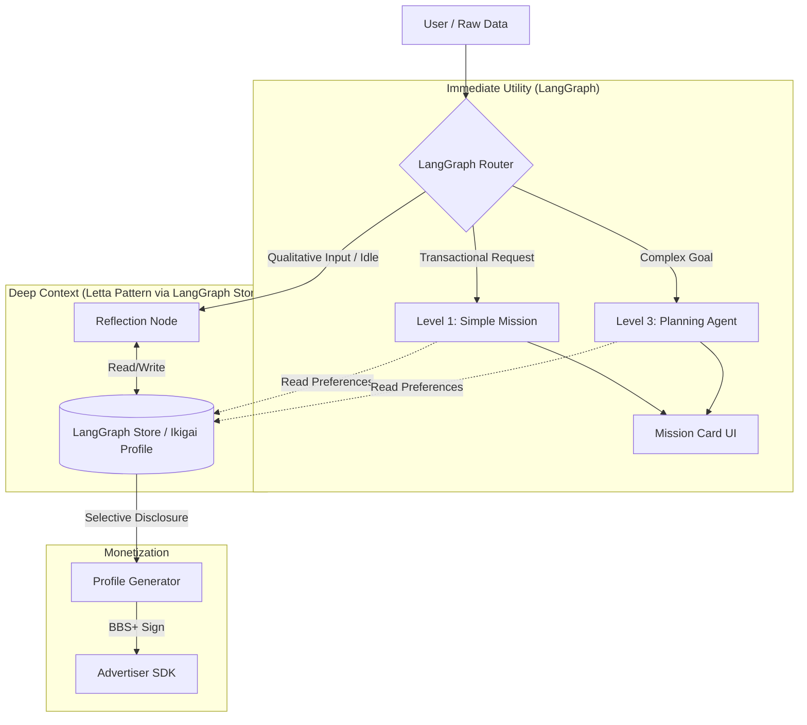

Based on the comprehensive documentation provided for **OwnYou**, particularly the *Mission Agents Architecture*, *Consumer App Requirements*, and *Vision*, here is a detailed architectural comparison and synthesis of **LangGraph** vs. **Letta** (formerly MemGPT).

### Executive Summary

For **OwnYou**, the choice is not binary.
*   **LangGraph** is the **Nervous System**: It is essential for the *Mission Agents* (Level 1-3 complexity routing), deterministic workflows (booking travel, switching energy providers), and the "Human-in-the-Loop" interrupt patterns described in your architecture.
*   **Letta** is the **Hippocampus/Conscious Self**: It excels at the *Ikigai* aspect—maintaining a cohesive, evolving psychological profile of the user over months/years, managing context windows, and self-editing its own system instructions based on user behavior.

**Recommendation:** For the MVP, **LangGraph is strictly necessary** to fulfill the functional requirements of Mission Agents. However, for the "Richest Personal AI Experience," you should architect the **User Profile/Ikigai Store** using Letta’s principles (or integrate Letta as a node within LangGraph) to handle the deep personalization.

---

### 1. Comparative Analysis based on OwnYou Requirements

| Requirement | LangGraph Capability | Letta (MemGPT) Capability | Winner for OwnYou |
| :--- | :--- | :--- | :--- |
| **Mission Execution** (Shopping, Booking, Bills) | **Excellent.** Explicit state machines (Graphs), cyclic flows, and reliable tool calling. Essential for the Level 1-3 complexity routing defined in your docs. | **Weak.** primarily chat-based. Lacks the fine-grained control flow required for complex, multi-step transactional missions (e.g., "Switch Energy Provider"). | **LangGraph** |
| **Long-Running Threads** (Persistence) | **Native.** Uses Checkpointers (Postgres/SQLite). Allows pausing a mission for days (e.g., waiting for user feedback) and resuming state perfectly. | **Native.** Designed for "infinite" conversations, but focuses on chat history rather than execution state of a specific task. | **LangGraph** (for Missions) |
| **Ikigai / Profiling** (Deep Personalization) | **Good (via Store).** You can implement long-term memory using `LangGraph Store`, but you have to code the logic for *how* and *when* to update it. | **Superior.** Built specifically to manage "Core Memory" (The User Block). It autonomously decides what to remember/forget to maintain a consistent persona/understanding of the user. | **Letta** |
| **Privacy & Local Compute** | **High.** Python-based, easily bundles into a local app/container. Agnostic to the LLM (can use local Ollama/Llama.cpp). | **Medium/High.** Can run locally, but often requires running a dedicated Letta server/service, which adds overhead to a consumer device MVP. | **LangGraph** |
| **Data Ingestion** (Email, Browser, Bank) | **Strong.** You can build specific "Ingestion Graphs" (ETL pipelines) that process raw data into memory blocks. | **Passive.** Better suited to analyzing the *text* of the data streams rather than structuring them into actionable database rows. | **LangGraph** |
| **Advertising / Attribution** (BBS+ context) | **Flexible.** You can inject `tracking_ID` and `context_id` into the state schema explicitly for every step of a mission. | **Opaque.** Harder to force the strict cryptographic/attribution flow required by your Advertising MVP within Letta's cognitive loop. | **LangGraph** |

---

### 2. Deep Dive: Why LangGraph is the "Engine"

Your **Mission Agents Architecture** describes a system that requires:
1.  **Adaptive Routing:** Classifying a request as Level 1 (Simple), Level 2 (Coordinated), or Level 3 (Complex).
2.  **Explicit Lifecycle:** `CREATED -> PLANNING -> EXECUTING -> INTERRUPTED`.
3.  **Structured Output:** Creating "Mission Cards" for the UI.

LangGraph is the only framework of the two that allows you to code this explicitly.

**How LangGraph fulfills the OwnYou Spec:**
*   **The Graph Structure:** You will define a `SuperGraph` that acts as the Router. It receives a `Trigger` (from the browser extension or email parser), assesses complexity, and hands off to a `SubGraph`.
*   **Persistence Layer:** The `PostgresCheckpointer` mentioned in your architecture is a native LangGraph component. This ensures that if a user "Snoozes" a shopping mission, the exact state is saved to the local database and rehydrated next week.
*   **Human-in-the-Loop:** OwnYou relies on the user approving actions (e.g., "Click to buy"). LangGraph has native `interrupt_before` logic that pauses execution until the user provides the specific input required.

### 3. Deep Dive: Why Letta is the "Soul" (Ikigai)

Your **Ikigai** document describes finding "joy in day-to-day life" and understanding the user's values, not just their transaction history.

LangGraph puts data in a database, but it doesn't necessarily "ponder" it. Letta (MemGPT) is designed to:
1.  **Manage Context Window:** It acts as an OS, swapping memories in and out of the LLM's limited context window.
2.  **Self-Edit:** If the user mentions "I've stopped eating meat," Letta autonomously updates its "Core Memory" block to say `Dietary Preference: Vegetarian`.
3.  **Psychological Continuity:** It simulates a continuous stream of consciousness, which is vital for the "Quietly Intelligent Companion" persona described in your Consumer App requirements.

### 4. The "Better Together" Architecture

To deliver the **richest experience**, you should not choose one. You should embed Letta (or Letta-like logic) *inside* your LangGraph architecture.

Here is how they integrate into the OwnYou stack:

#### Layer 1: The Orchestrator (LangGraph)
This is the main control loop running on the user's device.
*   **Input:** Raw data (Browser Extension, Email) + User Chat.
*   **Router:** Decides if this is a "Mission" (Action) or "Reflection" (Ikigai).
*   **Memory:** Uses `LangGraph Store` for storing raw IAB classifications and transaction logs.

#### Layer 2: The Ikigai Node (Letta)
One specific node in your LangGraph is the "Ikigai Agent."
*   **Role:** When the system is idle, or when highly qualitative data comes in (e.g., a voice journal entry), the LangGraph router sends this to the Letta Node.
*   **Action:** The Letta Node manages the `User Block` (Core Personality Profile). It reads the recent "Mission" outcomes and updates the user's long-term profile.
    *   *Example:* LangGraph executes a mission to book a theatre ticket. Success.
    *   *Letta Update:* "User enjoys comedy theatre. This aligns with their stated goal of 'laughing more'. Update Ikigai profile: Value = Humor."

#### Layer 3: The Mission Executors (LangGraph)
These are the Level 1-3 graphs defined in your architecture.
*   They **Read** from the Letta-maintained Profile (to know *preferences*).
*   They **Write** to the LangGraph Checkpointer (to track *progress*).

### 5. Implementation Strategy for MVP (Zero Budget/Solo Founder)

Given the constraint of a single founder, running a full Letta server alongside a LangGraph application might be too much infrastructure overhead.

**Recommended Path:**

1.  **Adopt LangGraph as the Primary Framework.** It handles the critical "Mission" logic which is the core utility driver.
2.  **Simulate Letta using `LangGraph Store`.**
    The provided *LangGraph Memory* documentation shows how to use the `Store` for cross-thread persistence. You can implement a "lightweight Letta" pattern:
    *   Create a specific file/namespace in the Store called `/memories/ikigai_profile.txt`.
    *   Add a "Reflection Node" to your graph that runs periodically (e.g., every night or after 5 interactions).
    *   **Prompt for Reflection Node:** *"Review the recent interactions and the current /memories/ikigai_profile.txt. Update the profile to better reflect the user's values, stripping out temporary transactional details."*

**This gives you 80% of the Letta value (evolving profile) with 0% of the infrastructure overhead, keeping the entire stack within the LangGraph/Python ecosystem.**

### 6. Advertising Integration Note

When generating the **BBS+ Pseudonym** and **Consumer Profile** for the Advertising MVP:
1.  **Source Data:** The "Consumer Profile" should be pulled from the *Semantic Memory* (the Ikigai profile built by the Reflection Node).
2.  **Provenance:** LangGraph is excellent here. You can track exactly *which* email or browsing session contributed to a specific attribute (e.g., "Interest: Hiking") because LangGraph allows you to store metadata with every state update. This is crucial for the "Provably Authentic" claim in your value proposition.

### Summary Diagram

