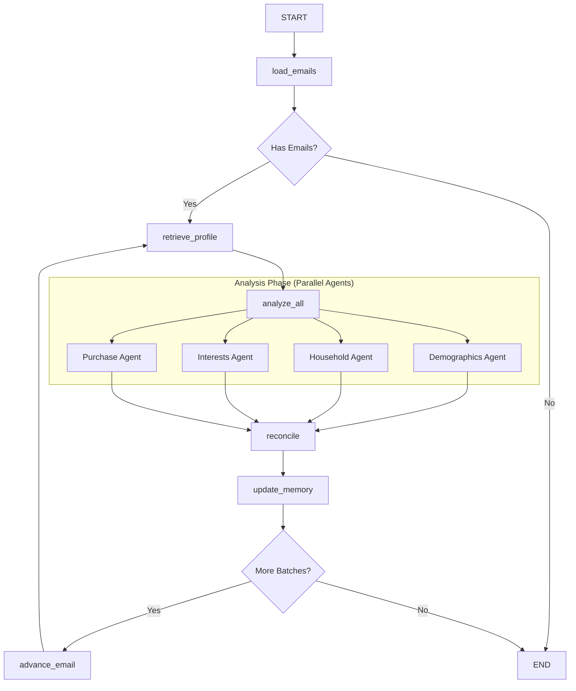

# Python IAB Classifier Architecture

**Version:** 1.0 (Baseline for Migration)
**Date:** 2025-11-19
**Source Root:** `src/email_parser/`

## 1. Overview

The Python IAB Classifier is a LangGraph-based workflow designed to analyze emails and extract consumer profile attributes based on the **IAB Audience Taxonomy 1.1**. It uses a multi-agent architecture with a "Judge" pattern to ensure evidence quality and prevent hallucinations.

### High-Level Workflow

The system processes emails in **batches** (dynamically sized based on LLM context window) through a cyclic graph.

---

## 2. Core Components

### 2.1 Workflow Graph (`workflow/graph.py`)

The workflow is defined as a `StateGraph` with the following nodes:

| Node | Function | Description |
|------|----------|-------------|
| `load_emails` | `load_new_emails_node` | Loads emails, filters already processed IDs, initializes batching state. |
| `retrieve_profile` | `retrieve_existing_profile_node` | Fetches existing IAB profile from memory (Semantic Memory) for the user. |
| `analyze_all` | `analyze_all_node` | Orchestrator node that executes all 4 analyzer agents on the current batch. |
| `reconcile` | `reconcile_evidence_node` | Merges new classifications with existing profile using Bayesian updates. |
| `update_memory` | `update_memory_node` | Persists updated profile and processed email IDs to storage. |
| `advance_email` | `_advance_email_node` | Advances `current_batch_start` to the next batch of emails. |

**Key Logic:**
- **Cyclic Processing:** The graph explicitly loops back from `advance_email` to `retrieve_profile` until all batches are processed.
- **Conditional Edges:**
    - `_check_has_emails_conditional`: Checks `total_emails > 0`.
    - `_check_continuation_conditional`: Checks `has_more_batches(state)`.

### 2.2 State Management (`workflow/state.py`)

The `WorkflowState` is a `TypedDict` containing:

**Context:**
- `user_id`: Unique user identifier.
- `emails`: List of all loaded emails.
- `processed_email_ids`: List of IDs to skip (persistence).

**Batching:**
- `current_batch_start`: Index of the first email in current batch.
- `batch_size`: Number of emails in current batch (dynamic).
- `model_context_window`: Token limit of the LLM (e.g., 128k).

**Results (Per Batch):**
- `demographics_results`: List of `TaxonomySelection` dicts.
- `household_results`: List of `TaxonomySelection` dicts.
- `interests_results`: List of `TaxonomySelection` dicts.
- `purchase_results`: List of `TaxonomySelection` dicts.

**Profile:**
- `existing_profile`: Profile before batch analysis.
- `updated_profile`: Profile after reconciliation.

### 2.3 Batch Optimizer (`workflow/batch_optimizer.py`)

Dynamically calculates `batch_size` to maximize context utilization while preventing overflows.

**Algorithm:**
1.  **Estimate Tokens:** Heuristic `(len(subject) + len(body) + 100) / 4`.
2.  **Target Utilization:** Uses 70% of `model_context_window` (leaving 30% for system prompts and output).
3.  **Greedy Packing:** Adds emails to batch until `cumulative_tokens > available_tokens`.
4.  **Constraints:** Respects `min_batch_size` (default 5) and `max_batch_size` (default 50).

---

## 3. Analyzer System (`workflow/nodes/analyzers.py`)

There are 4 specialized analyzer nodes, each following the same pipeline:

1.  **Batch Retrieval:** `get_current_batch(state)`.
2.  **Agent Execution:** Calls specific ReAct agent (e.g., `extract_demographics_with_agent`).
    - Agents use `AnalyzerLLMClient`.
    - Agents have access to taxonomy search tools.
3.  **Evidence Validation (The "Judge"):**
    - Calls `evaluate_evidence_quality` for each classification.
    - **Blocking:** Drops classifications with `quality_score < 0.15`.
    - **Adjustment:** Modifies confidence based on quality (see Section 4).
4.  **Taxonomy Validation:**
    - Verifies `taxonomy_id` matches `value` in loaded taxonomy.
    - Handles `*Extension` placeholders (allows LLM value).
    - Enforces exact matches for standard categories.

### Taxonomy Context (`workflow/taxonomy_context.py`)
- Dynamically generates prompt context from `IABTaxonomyLoader`.
- Filters out `*Extension` entries to reduce noise.
- Groups categories by `tier_2` or `grouping_value` to show mutual exclusivity structure.

---

## 4. Evidence Judge System (`workflow/nodes/evidence_judge.py`)

A critical component that acts as a quality gate for LLM inferences.

### 4.1 Quality Scoring
Assigns a score based on evidence type:
- **Explicit (1.0):** Direct statement in text.
- **Contextual (0.7):** Strong inference (e.g., graduation year → age).
- **Weak (0.4):** Indirect signal.
- **Inappropriate (0.0):** Wrong evidence type (e.g., inferring gender from product interest).

### 4.2 Hallucination Detection
Two-layer detection:
1.  **Metadata Check:** Checks if `email_numbers` in classification > `actual_batch_size`.
2.  **Text Analysis:** Regex search `\bEmail\s+(\d+)\b` in reasoning text against `actual_batch_size`.

### 4.3 Confidence Adjustment
Formula: `adjusted_conf = original_conf * modifier`

| Evidence Type | Quality Score | Modifier Logic |
|---------------|---------------|----------------|
| Explicit | Any | `quality_score` (1.0) |
| Contextual | 0.6 - 0.8 | `min(0.85, quality_score + 0.15)` (Boosted slightly) |
| Weak | 0.3 - 0.5 | `min(0.65, quality_score + 0.25)` (Boosted slightly) |
| Inappropriate | < 0.15 | `0.0` (Blocked) |

### 4.4 Parallel Execution
`evaluate_evidence_quality_batch` uses `ThreadPoolExecutor` to run judge LLM calls in parallel (up to 5 workers) for performance.

---

## 5. Data Flow & Persistence

1.  **Input:** Raw emails (Gmail/Outlook/CSV).
2.  **Filtering:** `load_emails` removes IDs present in `memory_manager.get_processed_email_ids()`.
3.  **Analysis:** Agents produce `TaxonomySelection` objects.
4.  **Reconciliation:**
    - `reconcile_evidence_node` merges new classifications with `existing_profile`.
    - Uses **Bayesian updating** for confidence scores (logic in `workflow/nodes/reconcile.py`).
5.  **Storage:** `update_memory_node` saves:
    - Updated profile to Semantic Memory.
    - Processed email IDs to prevent re-processing.

## 6. File Structure Mapping

| Component | Python File | Key Classes/Functions |
|-----------|-------------|-----------------------|
| **Workflow** | `src/email_parser/workflow/graph.py` | `build_workflow_graph` |
| **State** | `src/email_parser/workflow/state.py` | `WorkflowState`, `create_initial_state` |
| **Batching** | `src/email_parser/workflow/batch_optimizer.py` | `calculate_batch_size` |
| **Analyzers** | `src/email_parser/workflow/nodes/analyzers.py` | `demographics_analyzer_node`, etc. |
| **Judge** | `src/email_parser/workflow/nodes/evidence_judge.py` | `evaluate_evidence_quality` |
| **Taxonomy** | `src/email_parser/workflow/taxonomy_context.py` | `get_demographics_taxonomy_context` |
| **Loader** | `src/email_parser/utils/iab_taxonomy_loader.py` | `IABTaxonomyLoader` |
