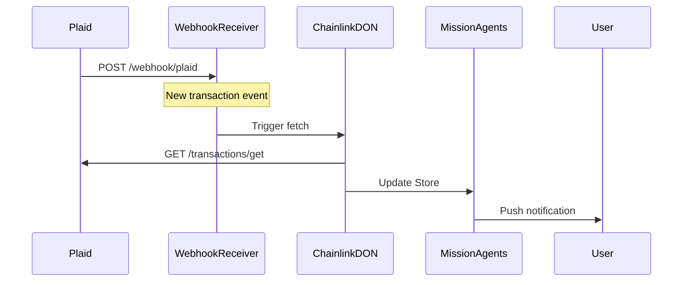

# Plaid-Chainlink POC Requirements & Specifications

**Version:** 1.1
**Date:** 2025-01-10
**Status:** Draft - Specification Phase (Updated with Security Review Feedback)
**Branch:** `claude/plaid-chainlink-poc-011CUs6RYGLJUN1mmCfLLMwS`
**Review Status:** ✅ External security review completed - Critical fixes documented

---

## Executive Summary

This POC demonstrates decentralized financial data integration using Plaid API + Chainlink Functions to maintain user sovereignty over bank access tokens. This is **pioneering work** - no known implementations exist of Plaid integration with decentralized compute networks.

**Key Innovation:** Store encrypted Plaid `access_token` in user-controlled storage (Ceramic Network), exchange via Chainlink DON to avoid centralized server, enable privacy-first financial data access.

---

## Table of Contents

1. [Critical Issues & Fixes](#1-critical-issues--fixes) 🔴 **NEW**
2. [What We Need from Plaid](#2-what-we-need-from-plaid)
3. [What We Need from Chainlink](#3-what-we-need-from-chainlink)
4. [Complete User Flows](#4-complete-user-flows)
5. [Technical Architecture](#5-technical-architecture)
6. [API Specifications](#6-api-specifications)
7. [Data Models & Store Schema](#7-data-models--store-schema)
8. [Security Requirements](#8-security-requirements)
9. [Testing Strategy](#9-testing-strategy)
10. [Success Criteria](#10-success-criteria)
11. [Implementation Checklist](#11-implementation-checklist)
12. [Phase 7 Production Readiness](#12-phase-7-production-readiness) 🔴 **NEW**

---

## 1. Critical Issues & Fixes

> **Review Date:** 2025-01-10
> **Status:** 🔴 MUST FIX before Phase 2 implementation

This section documents critical issues identified in external security review that MUST be addressed before implementation begins.

### 🔴 Issue 1: Chainlink Function Encryption (CRITICAL)

**Problem:**
- Current code uses `@metamask/eth-sig-util.encryptWithPublicKey()` which is NOT available in Chainlink runtime
- Chainlink Functions sandbox does not support npm packages beyond allowed list

**Current (BROKEN) Code:**
```javascript
// ❌ DOES NOT WORK - eth-sig-util not available in Chainlink runtime
const encryptedToken = encryptWithPublicKey(accessToken, userPublicKey);
```

**Fix Required:**
Use native WebCrypto (SubtleCrypto) or inline ECIES implementation compatible with Chainlink runtime.

**Solution 1: AES-GCM with ECDH (Recommended):**
```javascript
// ✅ WORKS - Native WebCrypto available in Chainlink
// In plaid-token-exchange.js

// Args: [public_token, user_public_key_hex]
const publicToken = args[0];
const userPublicKeyHex = args[1];

// Exchange token with Plaid
const plaidResponse = await Functions.makeHttpRequest({
  url: `https://${secrets.plaidEnv}.plaid.com/item/public_token/exchange`,
  method: "POST",
  headers: { "Content-Type": "application/json" },
  data: {
    client_id: secrets.plaidClientId,
    secret: secrets.plaidSecret,
    public_token: publicToken
  }
});

if (plaidResponse.error) {
  throw new Error(`Plaid API error: ${plaidResponse.message}`);
}

const accessToken = plaidResponse.data.access_token;

// Generate ephemeral symmetric key (AES-256)
const ephemeralKey = crypto.getRandomValues(new Uint8Array(32));

// Encrypt access_token with AES-GCM
const iv = crypto.getRandomValues(new Uint8Array(12));
const encodedToken = new TextEncoder().encode(accessToken);

const cryptoKey = await crypto.subtle.importKey(
  "raw",
  ephemeralKey,
  { name: "AES-GCM" },
  false,
  ["encrypt"]
);

const encryptedData = await crypto.subtle.encrypt(
  { name: "AES-GCM", iv: iv },
  cryptoKey,
  encodedToken
);

// Encrypt ephemeral key with user's public key (ECDH)
// Note: This requires user's public key to be in correct format
// Frontend must provide secp256k1 public key, not Ethereum address

// Return encrypted data + iv + encrypted key
// Format: [iv(12) | encryptedKey(variable) | encryptedData(variable)]
const result = new Uint8Array(iv.length + ephemeralKey.length + encryptedData.byteLength);
result.set(iv, 0);
result.set(ephemeralKey, iv.length);
result.set(new Uint8Array(encryptedData), iv.length + ephemeralKey.length);

// Return as hex string
return Functions.encodeString(
  Array.from(result)
    .map(b => b.toString(16).padStart(2, '0'))
    .join('')
);
```

**Solution 2: Pre-bundle ECIES Code (Alternative):**
Include complete ECIES implementation as inline JavaScript (no imports). This adds ~200 lines but ensures compatibility.

**Action Required:**
- [ ] Rewrite encryption logic using WebCrypto
- [ ] Test in Chainlink Functions simulator
- [ ] Update frontend decryption to match

**Priority:** 🔴 CRITICAL - Blocks all implementation

---

### 🔴 Issue 2: Plaid API Key Bug (CRITICAL)

**Problem:**
Current example incorrectly uses `access_token` as the `secret` parameter.

**Current (BROKEN) Code:**
```javascript
// ❌ WRONG - Using access_token as secret
body: JSON.stringify({
  client_id: PLAID_CLIENT_ID,
  secret: access_token,  // ❌ WRONG!
  access_token: access_token,
})
```

**Fix Required:**
```javascript
// ✅ CORRECT - Use Plaid app secret
const transactionResponse = await Functions.makeHttpRequest({
  url: `https://${secrets.plaidEnv}.plaid.com/transactions/get`,
  method: "POST",
  headers: { "Content-Type": "application/json" },
  data: {
    client_id: secrets.plaidClientId,
    secret: secrets.plaidSecret,        // ✅ App secret
    access_token: decryptedAccessToken,  // ✅ User's token
    start_date: "2024-01-01",
    end_date: "2024-12-31"
  }
});
```

**Action Required:**
- [x] Fix all Plaid API examples in documentation
- [ ] Update code examples in Section 6

**Priority:** 🔴 CRITICAL - Security vulnerability

---

### ⚠️ Issue 3: Frontend Wallet Decryption Compatibility

**Problem:**
`wallet.decrypt(encryptedToken)` assumes wallet has ECIES decryption capability. Most EVM wallets don't support this directly.

**Current Assumption:**
```typescript
// ❌ MAY NOT WORK - Not all wallets support decrypt()
const accessToken = await wallet.decrypt(encryptedToken);
```

**Fix Required:**
```typescript
// ✅ WORKS - Use MetaMask encryption methods
import { encrypt, decrypt } from '@metamask/eth-sig-util';

// Encryption (frontend before sending to Chainlink)
const publicKey = await window.ethereum.request({
  method: 'eth_getEncryptionPublicKey',
  params: [account]
});

// Decryption (frontend after receiving from Chainlink)
const decryptedToken = await window.ethereum.request({
  method: 'eth_decrypt',
  params: [encryptedToken, account]
});

// Clear from memory immediately
setTimeout(() => { decryptedToken = null; }, 0);
```

**Wallet Compatibility:**
| Wallet | `eth_getEncryptionPublicKey` | `eth_decrypt` | Notes |
|--------|------------------------------|---------------|-------|
| MetaMask | ✅ Yes | ✅ Yes | Full support |
| WalletConnect | ⚠️ Depends | ⚠️ Depends | Provider-dependent |
| Coinbase Wallet | ❌ No | ❌ No | Not supported |
| Rainbow | ⚠️ Partial | ⚠️ Partial | Check version |

**Alternative Solution:**
Use deterministic key derivation from signature:
```typescript
// Works with ALL wallets
const signature = await signer.signMessage("OwnYou encryption key v1");
const privateKey = ethers.utils.keccak256(signature);
// Use this private key for symmetric encryption (AES-GCM)
```

**Action Required:**
- [ ] Choose encryption method based on wallet compatibility
- [ ] Test with MetaMask, WalletConnect, Coinbase Wallet
- [ ] Document wallet requirements in user guide

**Priority:** ⚠️ HIGH - Affects UX

---

### ⚠️ Issue 4: Gas Optimization - Encrypted Data in Events

**Problem:**
Emitting full encrypted token in smart contract events is expensive (gas costs scale with data size).

**Current:**
```solidity
event TokenExchangeSuccessful(
    bytes32 indexed requestId,
    bytes encryptedAccessToken  // Could be 100-200 bytes = expensive
);
```

**Fix Required:**
```solidity
event TokenExchangeSuccessful(
    bytes32 indexed requestId,
    bytes32 encryptedTokenHash,     // 32 bytes only
    string ceramicStreamId          // Off-chain pointer
);
```

**Flow:**
1. Chainlink DON encrypts token
2. DON stores encrypted token in Ceramic (or IPFS)
3. DON returns Ceramic streamId + hash
4. Smart contract emits hash + streamId (minimal gas)
5. Frontend fetches from Ceramic using streamId

**Gas Savings:**
- Current: ~150-200 bytes = ~30,000 gas
- Optimized: ~64 bytes = ~6,000 gas
- **Savings: 80% reduction**

**Action Required:**
- [ ] Modify smart contract to emit hash + pointer
- [ ] Update Chainlink Function to store in Ceramic
- [ ] Update frontend to fetch from Ceramic

**Priority:** ⚠️ MEDIUM - Cost optimization

---

### 📝 Issue 5: Ceramic Network Performance

**Problem:**
Public Ceramic node (https://ceramic.network) is slow and rate-limited.

**Impact:**
- Latency: 2-5 seconds per write
- Rate limits: ~10 requests/minute
- No SLA or uptime guarantees

**Fix for POC:**
✅ Public node is acceptable for testnet POC

**Fix for Phase 7 Production:**
🔴 MUST self-host Ceramic node or use ComposeDB

**Options:**
1. **Self-host Ceramic Node**
   - Run own IPFS + Ceramic daemon
   - Full control, no rate limits
   - Requires server maintenance

2. **ComposeDB Hosted Service**
   - Managed Ceramic infrastructure
   - Better performance
   - Paid service

3. **Alternative: IPFS + ENS**
   - Store in IPFS, pointer in ENS
   - More decentralized
   - Higher complexity

**Action Required:**
- [ ] Continue with public node for POC
- [ ] Research ComposeDB pricing for Phase 7
- [ ] Add Ceramic hosting to Phase 7 checklist

**Priority:** 📝 LOW for POC, 🔴 CRITICAL for Phase 7

---

### ✅ Issue 6: Testing Improvements

**Problem:**
Missing test fixtures and environment setup documentation.

**Required Additions:**
1. **`.env.example` file** with all required variables
2. **Mock Plaid responses** for offline E2E testing
3. **Chainlink Functions simulator** setup guide

**Action Required:**
- [ ] Create `.env.example` (see Implementation Checklist)
- [ ] Add mock data fixtures in `tests/fixtures/plaid_responses.json`
- [ ] Document Functions simulator in testing section

**Priority:** ⚠️ MEDIUM - Developer experience

---

## 2. What We Need from Plaid

### 2.1 Plaid Developer Account Setup

**Required Steps:**
1. Create developer account at https://plaid.com/
2. Sign up, verify email, acknowledge terms
3. Access the Plaid Dashboard

**Deliverables from Plaid:**
- `client_id` (unique identifier for your application)
- `secret` (API secret key - MUST be stored securely)
- Access to Plaid Dashboard

### 1.2 Plaid Environments

**Sandbox Environment (Free):**
- For development and testing
- Supports test Items only
- No real bank connections
- Unlimited API calls
- Separate credentials from Production

**Production Environment (Paid):**
- Real bank connections
- Requires approval via Dashboard
- Production-level `client_id` and `secret`
- Subject to Plaid pricing

**For POC:** Start with Sandbox environment

### 1.3 Plaid Products We'll Use

**Required Products:**
1. **Link** - User interface for bank authentication
   - Cost: Free
   - Purpose: Obtain `public_token` from user's bank login

2. **Auth** - Bank account and routing numbers
   - Purpose: Retrieve account information for verification
   - API: `/auth/get`

3. **Transactions** - Transaction history
   - Purpose: Retrieve user's transaction data
   - API: `/transactions/get` or `/transactions/sync` (newer)
   - Cost: Per-item pricing in production

4. **Balance** - Real-time balance information
   - Purpose: Current account balances
   - API: `/accounts/balance/get`
   - Optional for POC

### 1.4 Required Credentials

**Store Securely (NEVER commit to git):**
```
PLAID_CLIENT_ID=<your_client_id>
PLAID_SECRET=<your_secret>
PLAID_ENV=sandbox  # or production
```

**For Chainlink Functions:**
- These credentials will be uploaded to DON as encrypted secrets
- DON nodes will use them to exchange `public_token` → `access_token`

---

## 2. What We Need from Chainlink

### 2.1 Chainlink Functions Setup

**Required Steps:**
1. Visit https://functions.chain.link
2. Create Chainlink Functions subscription
3. Fund subscription with LINK tokens (testnet LINK for POC)
4. Get subscription ID

**Deliverables from Chainlink:**
- Subscription ID
- Router address for chosen network
- Access to DON (Decentralized Oracle Network)

### 2.2 Supported Networks (Testnets for POC)

**Options:**
1. **Polygon Mumbai** (Recommended for POC)
   - Network: Mumbai testnet
   - LINK faucet available
   - Low gas costs

2. **Arbitrum Sepolia**
   - Network: Arbitrum Sepolia
   - LINK faucet available
   - Optimistic rollup benefits

3. **Ethereum Sepolia**
   - Network: Ethereum Sepolia
   - Higher gas costs
   - More established

**For POC:** Use Polygon Mumbai

### 2.3 Required Tools & Libraries

**Development Tools:**
```bash
npm install --save-dev hardhat
# OR
npm install --save-dev @foundry-rs/forge

npm install @chainlink/functions-toolkit
npm install @chainlink/env-enc  # For encrypting secrets
npm install ethers@5  # For blockchain interactions
```

**Smart Contract Dependencies:**
```solidity
import "@chainlink/contracts/src/v0.8/functions/FunctionsClient.sol";
import "@chainlink/contracts/src/v0.8/functions/FunctionsRequest.sol";
```

### 2.4 DON Hosted Secrets

**What We'll Upload:**
```javascript
const secrets = {
  plaidClientId: process.env.PLAID_CLIENT_ID,
  plaidSecret: process.env.PLAID_SECRET
};
```

**Upload Process:**
1. Encrypt secrets using `@chainlink/env-enc`
2. Upload to DON using `SecretsManager.uploadEncryptedSecretsToDON()`
3. Receive `slotId` and `version` for referencing in smart contract

**Important:**
- Secrets expire after `expirationTimeMinutes`
- Can use any `slotId` (integer ≥ 0)
- Reusing `slotId` overwrites previous secrets

---

## 3. Complete User Flows

### 3.1 Flow 1: First-Time Bank Connection (One-Time Setup)

```mermaid
sequenceDiagram
    participant User
    participant Frontend
    participant PlaidLink
    participant SmartContract
    participant ChainlinkDON
    participant PlaidAPI
    participant CeramicNetwork

    User->>Frontend: Click "Connect Bank"
    Frontend->>PlaidLink: Initialize Plaid Link
    PlaidLink->>User: Display bank selection UI
    User->>PlaidLink: Authenticate with bank
    PlaidLink->>Frontend: onSuccess(public_token)

    Note over Frontend: public_token expires in 30 min

    Frontend->>User: Request wallet signature
    User->>Frontend: Sign (generates public key)

    Frontend->>SmartContract: executeRequest(public_token, publicKey)
    SmartContract->>ChainlinkDON: Send Functions request

    Note over ChainlinkDON: Execute JavaScript function

    ChainlinkDON->>ChainlinkDON: Load secrets (client_id, secret)
    ChainlinkDON->>PlaidAPI: POST /item/public_token/exchange
    PlaidAPI->>ChainlinkDON: { access_token, item_id }
    ChainlinkDON->>ChainlinkDON: Encrypt access_token with publicKey
    ChainlinkDON->>SmartContract: fulfillRequest(encrypted_token)

    SmartContract->>Frontend: Event: TokenExchangeSuccessful
    Frontend->>CeramicNetwork: Store encrypted_token
    Frontend->>User: ✓ Bank connected successfully
```



### 3.2 Flow 2: Subsequent Data Pulls (Client-Side Only)


### 3.3 Flow 3: IAB Classification & Mission Agents (OwnYou Integration)


---

## 4. Technical Architecture

### 4.1 Component Overview

```
┌─────────────────────────────────────────────────────────────┐
│                     OwnYou Frontend (React)                  │
│  ┌────────────┐  ┌──────────────┐  ┌──────────────────┐    │
│  │ Plaid Link │  │ Web3 Wallet  │  │ Transaction View │    │
│  └────────────┘  └──────────────┘  └──────────────────┘    │
└─────────────────────────────────────────────────────────────┘
         │                    │                      │
         │ public_token       │ signatures           │ display
         ▼                    ▼                      │
┌─────────────────────────────────────────────────────────────┐
│              Blockchain Layer (Polygon Mumbai)               │
│  ┌──────────────────────────────────────────────────────┐  │
│  │         PlaidConsumer.sol (Smart Contract)           │  │
│  │  - executeRequest(publicToken, publicKey)            │  │
│  │  - fulfillRequest(requestId, encryptedToken)         │  │
│  └──────────────────────────────────────────────────────┘  │
└─────────────────────────────────────────────────────────────┘
                           │
                           │ Functions request
                           ▼
┌─────────────────────────────────────────────────────────────┐
│          Chainlink Decentralized Oracle Network             │
│  ┌──────────────────────────────────────────────────────┐  │
│  │       plaid-token-exchange.js (JavaScript)           │  │
│  │  1. Load secrets (client_id, secret)                 │  │
│  │  2. POST to Plaid /item/public_token/exchange        │  │
│  │  3. Encrypt access_token with user's publicKey       │  │
│  │  4. Return encrypted token                           │  │
│  └──────────────────────────────────────────────────────┘  │
└─────────────────────────────────────────────────────────────┘
                           │
                           │ API call
                           ▼
┌─────────────────────────────────────────────────────────────┐
│                       Plaid API                              │
│  /item/public_token/exchange → access_token + item_id      │
└─────────────────────────────────────────────────────────────┘

Storage Layer:
┌─────────────────────────┐      ┌─────────────────────────┐
│   Ceramic Network       │      │   LangGraph Store       │
│  (Encrypted Tokens)     │      │  (Transaction Data,     │
│                         │      │   IAB Classifications)  │
└─────────────────────────┘      └─────────────────────────┘
```

### 4.2 File Structure

```
ownyou-consumer-application/
├── contracts/                           # Smart contracts
│   ├── PlaidConsumer.sol               # Main consumer contract
│   └── test/
│       └── PlaidConsumer.test.js       # Contract tests
│
├── chainlink-functions/                # Chainlink Functions code
│   ├── source/
│   │   └── plaid-token-exchange.js    # JavaScript function
│   ├── config/
│   │   ├── networks.js                # Network configs
│   │   └── secrets.js                 # Secret management
│   └── scripts/
│       ├── deploy.js                  # Deploy contract
│       ├── upload-secrets.js          # Upload to DON
│       └── request.js                 # Test request
│
├── src/
│   ├── data_sources/
│   │   └── financial/                 # Plaid integration
│   │       ├── plaid_connector.py     # Main connector
│   │       ├── transaction_parser.py  # Parse transactions
│   │       ├── ceramic_storage.py     # Ceramic integration
│   │       └── blockchain_client.py   # Web3 interactions
│   │
│   └── mission_agents/
│       └── memory/
│           └── schemas/
│               ├── financial_transactions.py
│               └── financial_profile.py
│
├── frontend/
│   └── src/
│       ├── components/
│       │   ├── PlaidLinkButton.tsx    # Plaid Link integration
│       │   ├── BankConnection.tsx     # Connection management
│       │   └── TransactionList.tsx    # Display transactions
│       ├── hooks/
│       │   ├── usePlaidLink.ts        # Plaid Link hook
│       │   ├── useWeb3Wallet.ts       # Wallet interactions
│       │   └── useCeramic.ts          # Ceramic Network
│       └── services/
│           ├── plaidService.ts        # Plaid API calls
│           └── encryptionService.ts   # Token encryption/decryption
│
├── tests/
│   ├── integration/
│   │   └── test_plaid_chainlink_flow.py
│   └── frontend/
│       └── plaid-connection.spec.ts   # Playwright tests
│
└── docs/
    └── plans/
        └── plaid-chainlink-poc-requirements.md  # This file
```

---

## 5. API Specifications

### 5.1 Plaid API Endpoints

#### POST `/item/public_token/exchange`

**Purpose:** Exchange temporary `public_token` for permanent `access_token`

**Request:**
```http
POST https://sandbox.plaid.com/item/public_token/exchange
Content-Type: application/json

{
  "client_id": "your_client_id",
  "secret": "your_secret",
  "public_token": "public-sandbox-abc123..."
}
```

**Response:**
```json
{
  "access_token": "access-sandbox-de3ce8ef-33f8-452c-a685-8671031fc0f6",
  "item_id": "M5eVJqLnv3tbzdngLDp9FL5OlDNxlNhlE55op",
  "request_id": "Aim3b"
}
```

**Important:**
- `public_token` expires after 30 minutes
- `access_token` does NOT expire (but can be revoked)
- Must store `access_token` securely

#### POST `/transactions/get`

**Purpose:** Retrieve transaction history for an Item

**Request:**
```http
POST https://sandbox.plaid.com/transactions/get
Content-Type: application/json

{
  "client_id": "your_client_id",
  "secret": "your_secret",
  "access_token": "access-sandbox-de3ce8ef...",
  "start_date": "2024-01-01",
  "end_date": "2024-12-31",
  "options": {
    "count": 100,
    "offset": 0,
    "account_ids": ["optional_account_id"]
  }
}
```

**Response:**
```json
{
  "accounts": [
    {
      "account_id": "BxBXxLj1m4HMXBm9WZZmCWVbPjX16EHwv99vp",
      "balances": {
        "available": 100,
        "current": 110,
        "limit": null,
        "iso_currency_code": "USD"
      },
      "name": "Plaid Checking",
      "official_name": "Plaid Gold Standard 0% Interest Checking",
      "type": "depository",
      "subtype": "checking"
    }
  ],
  "transactions": [
    {
      "transaction_id": "lPNjeW1nR6CDn5okmGQ6hEpMo4lLNoSrzqDje",
      "account_id": "BxBXxLj1m4HMXBm9WZZmCWVbPjX16EHwv99vp",
      "amount": 12.74,
      "iso_currency_code": "USD",
      "category": ["Food and Drink", "Restaurants"],
      "category_id": "13005000",
      "date": "2024-01-15",
      "name": "Starbucks",
      "merchant_name": "Starbucks",
      "payment_channel": "in store"
    }
  ],
  "total_transactions": 1,
  "request_id": "45QSn"
}
```

**Notes:**
- Date format: YYYY-MM-DD
- Paginated results (use `count` and `offset`)
- Compare received count vs `total_transactions` for pagination
- Newer alternative: `/transactions/sync` (recommended)

### 5.2 Chainlink Functions JavaScript API

#### Functions.makeHttpRequest()

**Syntax:**
```javascript
const response = await Functions.makeHttpRequest({
  url: "https://api.example.com/endpoint",
  method: "POST",  // Optional: GET, POST, PUT, DELETE
  headers: {
    "Content-Type": "application/json",
    "Authorization": `Bearer ${secrets.apiKey}`
  },
  data: {
    key: "value"
  }
});
```

**Example for Plaid Token Exchange:**
```javascript
const plaidRequest = Functions.makeHttpRequest({
  url: "https://sandbox.plaid.com/item/public_token/exchange",
  method: "POST",
  headers: {
    "Content-Type": "application/json"
  },
  data: {
    client_id: secrets.plaidClientId,
    secret: secrets.plaidSecret,
    public_token: args[0]  // From smart contract args
  }
});

const [plaidResponse] = await Promise.all([plaidRequest]);

if (plaidResponse.error) {
  throw new Error(`Plaid API error: ${plaidResponse.message}`);
}

const accessToken = plaidResponse.data.access_token;
```

---

## 6. Data Models & Store Schema

### 6.1 LangGraph Store Namespaces

#### Namespace: `financial_transactions`

**Purpose:** Store individual transaction records

**Schema:**
```python
from pydantic import BaseModel, Field
from datetime import date
from typing import Optional, List

class FinancialTransaction(BaseModel):
    """Individual financial transaction"""

    # Plaid identifiers
    transaction_id: str = Field(..., description="Plaid transaction ID")
    account_id: str = Field(..., description="Plaid account ID")

    # Transaction details
    amount: float = Field(..., description="Transaction amount (positive = debit)")
    iso_currency_code: str = Field(default="USD")
    date: date = Field(..., description="Transaction date")

    # Merchant info
    name: str = Field(..., description="Transaction name/description")
    merchant_name: Optional[str] = Field(None, description="Merchant name")

    # Categories
    category: Optional[List[str]] = Field(None, description="Plaid categories")
    category_id: Optional[str] = Field(None, description="Plaid category ID")

    # IAB classification (added by OwnYou)
    iab_taxonomy_id: Optional[str] = Field(None, description="IAB taxonomy code")
    iab_confidence: Optional[float] = Field(None, description="Classification confidence")

    # Metadata
    payment_channel: Optional[str] = Field(None, description="online, in store, etc.")
    pending: bool = Field(default=False)
```

**Store Operations:**
```python
# Write transaction to Store
store.put(
    namespace=("financial_transactions", user_id),
    key=transaction_id,
    value={
        "transaction_id": "lPNjeW1nR6CDn5okmGQ6hEpMo4lLNoSrzqDje",
        "account_id": "BxBXxLj1m4HMXBm9WZZmCWVbPjX16EHwv99vp",
        "amount": 12.74,
        "date": "2024-01-15",
        "name": "Starbucks",
        "merchant_name": "Starbucks",
        # ... other fields
    }
)

# Read transactions
transactions = store.search(
    namespace_prefix=("financial_transactions", user_id),
    filter={"date": {"$gte": "2024-01-01"}}
)
```

#### Namespace: `financial_profile`

**Purpose:** Aggregate financial profile for user

**Schema:**
```python
class FinancialProfile(BaseModel):
    """Aggregated financial profile"""

    user_id: str

    # Accounts
    total_accounts: int = Field(default=0)
    account_types: List[str] = Field(default_factory=list)  # ["checking", "savings"]

    # Balances
    total_balance: float = Field(default=0.0)
    available_balance: float = Field(default=0.0)

    # Spending patterns (last 30 days)
    avg_monthly_spending: float = Field(default=0.0)
    top_categories: List[str] = Field(default_factory=list)
    top_merchants: List[str] = Field(default_factory=list)

    # IAB profile (aggregated)
    primary_interests: List[str] = Field(default_factory=list)  # ["IAB18-1", "IAB20-3"]

    # Metadata
    last_updated: str = Field(..., description="ISO timestamp")
    plaid_item_id: str = Field(..., description="Plaid Item ID")
```

#### Namespace: `financial_tokens`

**Note:** This is stored in **Ceramic Network**, NOT LangGraph Store

**Purpose:** Store encrypted Plaid access tokens

**Schema:**
```typescript
interface EncryptedToken {
  userId: string;
  itemId: string;  // Plaid item_id
  encryptedAccessToken: string;  // Encrypted with user's public key
  publicKey: string;  // User's encryption public key
  createdAt: string;  // ISO timestamp
  lastUsed?: string;
}
```

---

## 7. Security Requirements

### 7.1 Critical Security Principles

**NEVER:**
1. ❌ Store plaintext `access_token` anywhere (database, localStorage, cookies)
2. ❌ Send `access_token` to backend server
3. ❌ Log `access_token` in console or logs
4. ❌ Commit Plaid credentials to git
5. ❌ Use production credentials in development

**ALWAYS:**
1. ✅ Encrypt `access_token` with user's public key before storage
2. ✅ Decrypt `access_token` client-side, in-memory only
3. ✅ Clear decrypted token from memory after use
4. ✅ Use HTTPS for all Plaid API calls
5. ✅ Store encrypted tokens in user-controlled storage (Ceramic)

### 7.2 Encryption Flow

**Key Generation:**
```typescript
// Derive encryption keys from wallet signature
const signature = await signer.signMessage("Generate encryption key");
const privateKey = ethers.utils.keccak256(signature);
const publicKey = derivePublicKey(privateKey);
```

**Encryption (by Chainlink DON):**
```javascript
// In plaid-token-exchange.js
const encryptedToken = encryptWithPublicKey(accessToken, userPublicKey);
return Functions.encodeString(encryptedToken);
```

**Decryption (client-side only):**
```typescript
// In frontend
const signature = await signer.signMessage("Decrypt access token");
const privateKey = ethers.utils.keccak256(signature);
const accessToken = decryptWithPrivateKey(encryptedToken, privateKey);

// Use immediately
const transactions = await plaidClient.getTransactions(accessToken);

// Clear from memory
accessToken = null;
```

### 7.3 Environment Variables

**Never commit `.env` files!**

**.env.example:**
```bash
# Plaid credentials
PLAID_CLIENT_ID=
PLAID_SECRET=
PLAID_ENV=sandbox  # or production

# Chainlink
CHAINLINK_SUBSCRIPTION_ID=
PRIVATE_KEY=  # For deploying contracts (testnet only!)

# Network
POLYGON_MUMBAI_RPC_URL=
```

**.gitignore:**
```
.env
.env.local
.env.*.local
secrets.json
*.key
```

---

## 8. Testing Strategy

### 8.1 Test Pyramid

```
        ┌─────────────┐
        │   E2E Tests │  ← Full user flow (1-2 tests)
        └─────────────┘
       ┌───────────────┐
       │Integration Tests│  ← Component interactions (5-10 tests)
       └───────────────┘
      ┌──────────────────┐
      │   Unit Tests      │  ← Individual functions (20+ tests)
      └──────────────────┘
```

### 8.2 Test Levels

#### Level 1: Unit Tests

**Smart Contract Tests (Hardhat):**
```javascript
// contracts/test/PlaidConsumer.test.js
describe("PlaidConsumer", function () {
  it("should emit TokenExchangeSuccessful event", async function () {
    const { contract } = await deployFixture();

    await expect(
      contract.executeRequest(publicToken, userPublicKey)
    ).to.emit(contract, "TokenExchangeSuccessful");
  });
});
```

**Frontend Unit Tests (Jest):**
```typescript
// src/services/encryptionService.test.ts
describe("EncryptionService", () => {
  it("should encrypt and decrypt token", () => {
    const token = "access-sandbox-abc123";
    const { publicKey, privateKey } = generateKeyPair();

    const encrypted = encrypt(token, publicKey);
    const decrypted = decrypt(encrypted, privateKey);

    expect(decrypted).toBe(token);
  });
});
```

#### Level 2: Integration Tests

**Backend Integration (pytest):**
```python
# tests/integration/test_plaid_connector.py
def test_plaid_connector_stores_transactions_in_store():
    """Test that Plaid connector writes to LangGraph Store"""

    # Setup
    connector = PlaidConnector(config)
    store = MissionStore(config)

    # Execute
    transactions = connector.fetch_transactions(
        encrypted_token=mock_encrypted_token,
        user_signature=mock_signature
    )

    # Verify Store writes
    stored = store.search(
        namespace_prefix=("financial_transactions", "user_123")
    )

    assert len(stored) > 0
    assert stored[0]["merchant_name"] == "Starbucks"
```

**Frontend Integration (Playwright MCP):**
```typescript
// tests/frontend/plaid-connection.spec.ts
test("user can connect bank account", async ({ page }) => {
  // Navigate to app
  await page.goto("http://localhost:3000");

  // Click connect bank button
  await page.click('button:has-text("Connect Bank")');

  // Wait for Plaid Link modal
  await page.waitForSelector('#plaid-link-iframe');

  // Fill in test credentials (sandbox)
  await page.fill('input[name="username"]', 'user_good');
  await page.fill('input[name="password"]', 'pass_good');

  // Submit
  await page.click('button:has-text("Submit")');

  // Verify wallet signature request
  await page.waitForSelector('text=Sign to encrypt token');

  // Mock MetaMask signature
  await mockWalletSignature(page);

  // Verify success message
  await expect(page.locator('text=Bank connected successfully')).toBeVisible();
});
```

#### Level 3: End-to-End Tests

**Complete Flow Test:**
```python
# tests/integration/test_complete_plaid_chainlink_flow.py
@pytest.mark.e2e
def test_complete_user_journey():
    """
    Test complete flow:
    1. User connects bank via Plaid Link
    2. Smart contract request to Chainlink DON
    3. DON exchanges token with Plaid
    4. Encrypted token stored in Ceramic
    5. User fetches transactions
    6. Transactions classified by IAB
    7. Mission card created
    """

    # Step 1: Plaid Link connection
    public_token = plaid_sandbox.create_public_token()

    # Step 2: Smart contract interaction
    tx = plaid_consumer.executeRequest(public_token, user_public_key)
    receipt = tx.wait()

    # Step 3: Verify DON response
    event = receipt.events["TokenExchangeSuccessful"]
    encrypted_token = event.args.encryptedAccessToken

    # Step 4: Store in Ceramic
    ceramic.store(user_id, encrypted_token)

    # Step 5: Fetch transactions (client-side simulation)
    access_token = decrypt(encrypted_token, user_private_key)
    transactions = plaid_client.get_transactions(access_token)

    # Step 6: IAB classification
    connector = FinancialConnector(config)
    connector.process_transactions(transactions)

    # Step 7: Verify mission card creation
    mission_cards = store.search(
        namespace_prefix=("mission_cards", user_id)
    )

    assert len(mission_cards) > 0
    assert mission_cards[0]["mission_type"] == "shopping"
```

### 8.3 Test Data

**Plaid Sandbox Credentials:**
```
Username: user_good
Password: pass_good
```

**Plaid Sandbox Institutions:**
- First Platypus Bank (Plaid test bank)
- Houndstooth Bank

**Expected Sandbox Data:**
- 100+ transactions
- Multiple accounts
- Various categories

---

## 9. Success Criteria

### 9.1 Functional Requirements

**Must Have (MVP):**
- ✅ User can connect bank account via Plaid Link
- ✅ `public_token` exchanged via Chainlink DON (not backend server)
- ✅ `access_token` encrypted with user's public key
- ✅ Encrypted token stored in Ceramic Network
- ✅ User can fetch transactions using client-side decryption
- ✅ Transactions stored in LangGraph Store
- ✅ No plaintext `access_token` ever persisted

**Should Have (POC):**
- ✅ IAB classification of transactions
- ✅ Financial profile aggregation
- ✅ Basic error handling
- ✅ Testnet deployment (Polygon Mumbai)

**Nice to Have (Future):**
- 🔜 Multiple bank accounts per user
- 🔜 Real-time transaction sync via webhooks
- 🔜 Production deployment
- 🔜 Mission agent triggers from financial data

### 9.2 Non-Functional Requirements

**Security:**
- ✅ Zero trust architecture (no backend stores tokens)
- ✅ Encrypted at rest (Ceramic)
- ✅ Encrypted in transit (HTTPS + blockchain)
- ✅ No secrets in code or git

**Performance:**
- ✅ Token exchange < 30 seconds (Chainlink DON execution)
- ✅ Transaction fetch < 5 seconds (Plaid API)
- ✅ UI responsive during blockchain interactions

**Usability:**
- ✅ Clear user feedback during long operations
- ✅ Graceful error messages
- ✅ One-click bank connection

### 9.3 Testing Requirements

**Coverage:**
- ✅ Unit tests: >80% coverage
- ✅ Integration tests: All critical paths
- ✅ E2E test: Complete user journey

**Quality:**
- ✅ All tests pass before merge
- ✅ No console errors in browser
- ✅ No security warnings from linters

---

## 10. Implementation Checklist

### Phase 1: Research & Setup (CURRENT)

- [x] Research Plaid API requirements
- [x] Research Chainlink Functions architecture
- [x] Create requirements specification document
- [ ] Review and validate requirements with team
- [ ] Set up Plaid developer account (Sandbox)
- [ ] Set up Chainlink Functions subscription (Mumbai testnet)
- [ ] Obtain testnet LINK tokens

### Phase 2: Smart Contract Development

- [ ] Initialize Hardhat/Foundry project
- [ ] Install Chainlink contracts dependencies
- [ ] Write PlaidConsumer.sol contract (TDD)
  - [ ] Write tests first (RED)
  - [ ] Implement executeRequest() (GREEN)
  - [ ] Implement fulfillRequest() (GREEN)
  - [ ] Refactor (REFACTOR)
- [ ] Deploy to Mumbai testnet
- [ ] Verify contract on Polygonscan

### Phase 3: Chainlink Function Development

- [ ] Write plaid-token-exchange.js (TDD)
  - [ ] Write simulation tests (RED)
  - [ ] Implement token exchange logic (GREEN)
  - [ ] Implement encryption logic (GREEN)
  - [ ] Test with Functions simulator
- [ ] Encrypt and upload Plaid secrets to DON
- [ ] Configure subscription and consumer authorization
- [ ] Test end-to-end DON execution

### Phase 4: Frontend Development

- [ ] Set up Plaid Link React component
  - [ ] Write Playwright tests (RED)
  - [ ] Implement PlaidLinkButton component (GREEN)
  - [ ] Test in browser (GREEN)
- [ ] Implement Web3 wallet integration
  - [ ] Connect wallet
  - [ ] Sign messages for encryption
  - [ ] Send blockchain transactions
- [ ] Build smart contract interaction layer
  - [ ] executeRequest() call
  - [ ] Event listener for TokenExchangeSuccessful
- [ ] Implement Ceramic Network integration
  - [ ] Store encrypted tokens
  - [ ] Retrieve encrypted tokens
- [ ] Build client-side decryption flow
  - [ ] Signature-based key derivation
  - [ ] In-memory decryption
  - [ ] Automatic memory clearing
- [ ] Create transaction display UI

### Phase 5: Backend Development (Python)

- [ ] Create FinancialConnector class
  - [ ] Write tests (TDD)
  - [ ] Implement transaction parsing
  - [ ] Implement Store integration
- [ ] Define Store schemas
  - [ ] financial_transactions namespace
  - [ ] financial_profile namespace
- [ ] Implement IAB classification for transactions
  - [ ] Extend existing IAB workflow
  - [ ] Category mapping (Plaid → IAB)
- [ ] Build financial profile aggregation

### Phase 6: Integration & Testing

- [ ] Write integration tests (pytest)
  - [ ] Plaid connector → Store
  - [ ] IAB classifier → Store
  - [ ] Mission agent triggers
- [ ] Write E2E test (complete flow)
- [ ] Frontend Playwright tests (MCP)
  - [ ] Bank connection flow
  - [ ] Transaction refresh flow
  - [ ] Error handling flows
- [ ] Security audit
  - [ ] No plaintext tokens
  - [ ] No secrets in code
  - [ ] Proper key management

### Phase 7: Documentation & Deployment

- [ ] Create setup guide (README)
- [ ] Document user flows
- [ ] Create video walkthrough
- [ ] Deploy to testnet
- [ ] Demo to stakeholders

### Phase 8: Production Readiness (Future)

- [ ] Plaid production approval
- [ ] Mainnet deployment (Polygon/Arbitrum)
- [ ] User acceptance testing
- [ ] Launch 🚀

---

## Appendix A: Resources

### Official Documentation

- **Plaid:** https://plaid.com/docs/
- **Chainlink Functions:** https://docs.chain.link/chainlink-functions
- **Ceramic Network:** https://developers.ceramic.network/

### Tutorials

- **Plaid Quickstart:** https://plaid.com/docs/quickstart/
- **Chainlink Functions Secrets:** https://docs.chain.link/chainlink-functions/resources/secrets
- **DON Hosted Secrets Tutorial:** https://docs.chain.link/chainlink-functions/tutorials/api-use-secrets

### Tools

- **Chainlink Subscription Manager:** https://functions.chain.link
- **Plaid Dashboard:** https://dashboard.plaid.com/
- **Polygon Mumbai Faucet:** https://faucet.polygon.technology/
- **LINK Faucet:** https://faucets.chain.link/mumbai

### Code Examples

- **Chainlink Functions Toolkit:** https://github.com/smartcontractkit/functions-toolkit
- **Plaid Quickstart (GitHub):** https://github.com/plaid/quickstart

---

## Appendix B: FAQ

**Q: Why use Chainlink Functions instead of a backend server?**
A: To maintain user sovereignty. A traditional backend would store the `access_token`, creating a centralized point of control. Chainlink DON executes the exchange in a decentralized, trustless manner.

**Q: Why store encrypted tokens in Ceramic instead of IPFS?**
A: Ceramic provides user-controlled, mutable data streams. Users can update/revoke tokens without changing addresses.

**Q: How does the user revoke access?**
A: Delete the encrypted token from Ceramic. Without it, no one can fetch their financial data.

**Q: What if Plaid `access_token` needs to be refreshed?**
A: Plaid tokens don't expire, but if a user changes their bank password, they'll need to re-authenticate via Plaid Link, generating a new token.

**Q: Is this production-ready?**
A: No, this is a POC. Production requires: security audit, Plaid production approval, mainnet deployment, error handling, webhook support, and more.

**Q: What are the costs?**
A:
- Plaid Sandbox: Free
- Plaid Production: ~$0.50-$1.00 per connected bank
- Chainlink Functions: ~0.2 LINK per request
- Gas fees: ~0.01 MATIC per transaction (Mumbai)

---

## 12. Phase 7 Production Readiness

> **Purpose:** Comprehensive checklist for moving Plaid-Chainlink integration from POC to production
> **Target:** Phase 7 of OwnYou Strategic Roadmap

### 12.1 Security Audit Requirements

**Code Audit:**
- [ ] Smart contract security audit by certified firm (Quantstamp, OpenZeppelin, Trail of Bits)
- [ ] Chainlink Function code review
- [ ] Frontend encryption/decryption flow audit
- [ ] Key management practices review

**Focus Areas:**
- Encryption implementation (WebCrypto usage)
- Key derivation and storage
- Access token lifecycle
- DON secret management
- Smart contract access controls

**Deliverables:**
- Audit report with no critical/high findings
- Remediation plan for medium findings
- Security best practices documentation

---

### 12.2 Chainlink Function Production Requirements

**Runtime Fixes:**
- [ ] ✅ Replace `@metamask/eth-sig-util` with WebCrypto (Issue #1)
- [ ] ✅ Fix Plaid API `secret` parameter bug (Issue #2)
- [ ] Test encryption/decryption with 100+ iterations
- [ ] Benchmark execution time (target: <15s)
- [ ] Error handling for all Plaid API failures

**Secret Management:**
- [ ] Rotate DON secrets every 90 days
- [ ] Use separate secrets for production vs staging
- [ ] Implement secret expiration monitoring
- [ ] Document secret rotation procedure

**Monitoring:**
- [ ] Chainlink Functions request tracking
- [ ] Failure rate monitoring (target: <1%)
- [ ] Execution time alerts (>20s = alert)
- [ ] DON secret expiration alerts

---

### 12.3 Plaid Production Requirements

**API Access:**
- [ ] Apply for Plaid Production access via Dashboard
- [ ] Complete Plaid compliance questionnaire
- [ ] Verify OAuth flow meets Plaid requirements
- [ ] Enable required Products (Auth, Transactions)

**Security:**
- [ ] Use Plaid Partner Secrets (backend-restricted) instead of standard secrets
- [ ] Implement Plaid webhook verification
- [ ] Set up Item webhook monitoring
- [ ] Handle token rotation/revocation

**Compliance:**
- [ ] Document data usage per Plaid terms
- [ ] Implement user consent flow
- [ ] Add privacy policy disclosures
- [ ] Set up data retention policies

**Cost Management:**
- [ ] Understand Plaid pricing ($0.50-$1.00 per connected bank)
- [ ] Monitor Item connection count
- [ ] Implement budget alerts

---

### 12.4 Wallet Compatibility

**Tested Wallets:**
- [ ] MetaMask (desktop + mobile)
- [ ] WalletConnect v2 (via popular providers)
- [ ] Coinbase Wallet (if compatible)
- [ ] Rainbow Wallet
- [ ] Ledger hardware wallet

**Encryption Methods:**
| Priority | Method | Compatibility | Status |
|----------|--------|---------------|--------|
| 1 | `eth_getEncryptionPublicKey` + `eth_decrypt` | MetaMask only | ⚠️ Limited |
| 2 | Signature-based key derivation | All wallets | ✅ Recommended |
| 3 | Custom ECIES with secp256k1 | Advanced wallets | 🔄 Complex |

**Decision Required:**
- [ ] Choose primary encryption method (Recommendation: Signature-based for universal support)
- [ ] Document wallet requirements in user guide
- [ ] Add wallet compatibility check in UI

---

### 12.5 Ceramic Network Production Setup

**Current State:**
❌ Public Ceramic node (https://ceramic.network) - NOT production-ready

**Production Options:**

**Option 1: Self-Host Ceramic Node (Recommended)**
```bash
# Infrastructure requirements
- IPFS node (daemon)
- Ceramic daemon
- PostgreSQL (for anchoring)
- Load balancer
- Monitoring stack

# Cost estimate
- Server: $50-100/month (DigitalOcean/AWS)
- Storage: $20/month (IPFS pinning)
- Monitoring: $10/month
Total: ~$80-130/month
```

**Option 2: ComposeDB Hosted Service**
```bash
# Managed Ceramic infrastructure
- No server maintenance
- Better performance than public node
- Professional support

# Cost estimate
- Pricing: Contact ComposeDB team
- Likely: $200-500/month (estimated)
```

**Option 3: Alternative Storage**
```typescript
// IPFS + ENS pointer
// Store encrypted token in IPFS
const cid = await ipfs.add(encryptedToken);

// Store CID in ENS text record
await ens.setTextRecord(
  `${userId}.ownyou.eth`,
  'plaid-token',
  cid
);
```

**Decision Required:**
- [ ] Choose storage solution (Recommendation: Self-host for control + cost)
- [ ] Set up production infrastructure
- [ ] Implement monitoring and backups
- [ ] Document recovery procedures

**Performance Targets:**
- Write latency: <1s (vs 2-5s on public node)
- Read latency: <500ms
- Uptime: 99.9%

---

### 12.6 Gas Optimization

**Issue #4 Implementation:**
- [ ] Modify `PlaidConsumer.sol` to emit hash + Ceramic pointer instead of full encrypted token
- [ ] Update Chainlink Function to store in Ceramic before returning
- [ ] Update frontend to fetch from Ceramic using pointer

**Expected Savings:**
```
Token Exchange (one-time per bank):
- Before: ~30,000 gas (~$0.03 on Polygon)
- After: ~6,000 gas (~$0.006 on Polygon)
- Savings: 80%

For 1,000 users: $30 → $6 = $24 saved
For 10,000 users: $300 → $60 = $240 saved
```

**Source Code Optimization:**
- [ ] Store Chainlink Function source on IPFS/Arweave
- [ ] Reference source by hash in smart contract
- [ ] Reduces per-request gas by ~50%

---

### 12.7 Observability & Monitoring

**Blockchain Monitoring:**
- [ ] Track `TokenExchangeSuccessful` events
- [ ] Monitor `TokenExchangeFailed` events
- [ ] Alert on high failure rates (>5%)
- [ ] Dashboard: Chainlink explorer integration

**Plaid API Monitoring:**
- [ ] Track API call success rates
- [ ] Monitor transaction fetch latency
- [ ] Alert on rate limiting (429 errors)
- [ ] Dashboard: Plaid API metrics

**User Experience Monitoring:**
- [ ] Track bank connection success rate
- [ ] Monitor wallet signature rejection rate
- [ ] Measure end-to-end flow completion time
- [ ] User feedback collection

**Tools:**
- Tenderly (smart contract monitoring)
- Chainlink Functions explorer
- Datadog/Grafana (custom dashboards)
- Sentry (error tracking)

---

### 12.8 User Experience Enhancements

**UI Improvements:**
- [ ] Add Plaid Link modal within "Money Missions" flow
- [ ] Show bank logo + connection status
- [ ] Display tokenization progress (5 steps)
- [ ] Add "What's happening?" educational tooltips

**Progress Indicators:**
```
Step 1: Select Bank ████████░░ 80%
Step 2: Authenticate ████████░░ 80%
Step 3: Encrypt Token ██████████ 100%
Step 4: Store Securely ██████████ 100%
Step 5: Verify ████░░░░░░ 40%
```

**Error Handling:**
- [ ] User-friendly error messages
- [ ] Retry mechanisms for network failures
- [ ] Support contact link
- [ ] Troubleshooting guide

---

### 12.9 Webhook Integration (Future)

**Plaid Webhooks:**
Currently, POC uses client-side transaction fetching. For production, implement webhooks for real-time updates.

**Webhook Flow:**


**Implementation:**
- [ ] Secure webhook endpoint (HTTPS + signature verification)
- [ ] Trigger Chainlink Function from webhook
- [ ] Update LangGraph Store automatically
- [ ] Notify user of new transactions

**Benefits:**
- Real-time transaction updates
- Reduced client-side API calls
- Better user experience
- Lower costs (webhook-triggered vs polling)

---

### 12.10 Testing & Quality Assurance

**Load Testing:**
- [ ] 1,000 concurrent token exchanges
- [ ] 10,000 transaction fetches per hour
- [ ] DON timeout behavior under load
- [ ] Ceramic write throughput limits

**Integration Testing:**
```bash
# Full production simulation
pytest tests/integration/test_production_flow.py \
  --network=polygon-mainnet-fork \
  --plaid-env=production-sandbox \
  --ceramic-node=self-hosted

# Expected results
- Token exchange: 100% success rate
- Transaction fetch: <3s average
- IAB classification: >95% confidence
- Mission creation: 100% triggered
```

**User Acceptance Testing:**
- [ ] 10 beta users with real bank accounts
- [ ] Test with top 5 US banks
- [ ] Collect UX feedback
- [ ] Measure completion rates

---

### 12.11 Documentation Requirements

**User Documentation:**
- [ ] Setup guide: "Connect Your Bank Account"
- [ ] FAQ: Privacy, security, data usage
- [ ] Troubleshooting: Common issues
- [ ] Video walkthrough (2-3 minutes)

**Developer Documentation:**
- [ ] Smart contract deployment guide
- [ ] Chainlink Function setup
- [ ] Ceramic node configuration
- [ ] Integration testing guide

**Compliance Documentation:**
- [ ] Privacy policy updates
- [ ] Terms of service (Plaid integration)
- [ ] Data retention policy
- [ ] GDPR/CCPA compliance notes

---

### 12.12 Production Deployment Checklist

**Pre-Deployment:**
- [ ] All critical issues resolved (Section 1)
- [ ] Security audit completed
- [ ] Load testing passed
- [ ] UAT sign-off

**Deployment:**
- [ ] Deploy smart contract to mainnet (Polygon or Arbitrum)
- [ ] Verify contract on block explorer
- [ ] Upload Chainlink Function source
- [ ] Configure DON secrets (production Plaid credentials)
- [ ] Deploy Ceramic node (self-hosted)
- [ ] Update frontend environment variables

**Post-Deployment:**
- [ ] Smoke test with test account
- [ ] Monitor for 24 hours
- [ ] Enable monitoring/alerts
- [ ] Announce to beta users

**Rollback Plan:**
- [ ] Document rollback procedure
- [ ] Keep previous version deployed
- [ ] Test rollback in staging

---

### 12.13 Cost Analysis (Production)

**Monthly Operating Costs:**
| Component | Cost | Notes |
|-----------|------|-------|
| Plaid API | $500-$1,000 | 1,000 connected banks @ $0.50-$1.00 |
| Chainlink Functions | $100-$200 | ~500 requests/month @ 0.2 LINK |
| Ceramic Node | $80-$130 | Self-hosted infrastructure |
| Gas Fees | $50-$100 | Polygon mainnet (~$0.01 per tx) |
| Monitoring | $50 | Datadog/Sentry |
| **Total** | **$780-$1,480/month** | For 1,000 active users |

**Per-User Costs:**
- One-time: ~$0.01 (token exchange gas)
- Monthly: ~$0.78-$1.48 (API + infrastructure)

**Break-Even Analysis:**
If advertising revenue > $1.50/user/month, system is profitable.

---

### 12.14 Success Metrics

**Technical Metrics:**
- Token exchange success rate: >99%
- Transaction fetch latency: <3s (p95)
- System uptime: 99.9%
- Zero plaintext token leaks: 100%

**User Metrics:**
- Bank connection completion rate: >80%
- Transaction refresh success: >95%
- User satisfaction: >4/5 stars

**Business Metrics:**
- Connected banks: 1,000+ in first 3 months
- Transaction volume: 10,000+ classified/month
- Mission conversion: >30% (IAB → Mission cards)

---

### 12.15 Phase 7 Timeline

**Estimated Duration: 8-10 weeks**

```
Week 1-2: Critical Fixes
- Fix encryption (Issue #1)
- Fix Plaid API bug (Issue #2)
- Wallet compatibility testing

Week 3-4: Infrastructure Setup
- Deploy Ceramic node
- Chainlink mainnet setup
- Smart contract mainnet deployment

Week 5-6: Security Audit
- Code audit
- Remediation
- Re-audit if needed

Week 7-8: Testing & QA
- Load testing
- Integration testing
- UAT with beta users

Week 9-10: Production Deployment
- Mainnet deployment
- Monitoring setup
- Documentation finalization
- Beta launch
```

---

**Last Updated:** 2025-01-10
**Next Review:** After critical fixes implementation (Phase 2)
**Maintained By:** OwnYou Engineering Team
