# Plaid-Chainlink POC Requirements & Specifications

**Version:** 1.0
**Date:** 2025-01-07
**Status:** Draft - Specification Phase
**Branch:** `claude/plaid-chainlink-poc-011CUs6RYGLJUN1mmCfLLMwS`

---

## Executive Summary

This POC demonstrates decentralized financial data integration using Plaid API + Chainlink Functions to maintain user sovereignty over bank access tokens. This is **pioneering work** - no known implementations exist of Plaid integration with decentralized compute networks.

**Key Innovation:** Store encrypted Plaid `access_token` in user-controlled storage (Ceramic Network), exchange via Chainlink DON to avoid centralized server, enable privacy-first financial data access.

---

## Table of Contents

1. [What We Need from Plaid](#1-what-we-need-from-plaid)
2. [What We Need from Chainlink](#2-what-we-need-from-chainlink)
3. [Complete User Flows](#3-complete-user-flows)
4. [Technical Architecture](#4-technical-architecture)
5. [API Specifications](#5-api-specifications)
6. [Data Models & Store Schema](#6-data-models--store-schema)
7. [Security Requirements](#7-security-requirements)
8. [Testing Strategy](#8-testing-strategy)
9. [Success Criteria](#9-success-criteria)
10. [Implementation Checklist](#10-implementation-checklist)

---

## 1. What We Need from Plaid

### 1.1 Plaid Developer Account Setup

**Required Steps:**
1. Create developer account at https://plaid.com/
2. Sign up, verify email, acknowledge terms
3. Access the Plaid Dashboard

**Deliverables from Plaid:**
- `client_id` (unique identifier for your application)
- `secret` (API secret key - MUST be stored securely)
- Access to Plaid Dashboard

### 1.2 Plaid Environments

**Sandbox Environment (Free):**
- For development and testing
- Supports test Items only
- No real bank connections
- Unlimited API calls
- Separate credentials from Production

**Production Environment (Paid):**
- Real bank connections
- Requires approval via Dashboard
- Production-level `client_id` and `secret`
- Subject to Plaid pricing

**For POC:** Start with Sandbox environment

### 1.3 Plaid Products We'll Use

**Required Products:**
1. **Link** - User interface for bank authentication
   - Cost: Free
   - Purpose: Obtain `public_token` from user's bank login

2. **Auth** - Bank account and routing numbers
   - Purpose: Retrieve account information for verification
   - API: `/auth/get`

3. **Transactions** - Transaction history
   - Purpose: Retrieve user's transaction data
   - API: `/transactions/get` or `/transactions/sync` (newer)
   - Cost: Per-item pricing in production

4. **Balance** - Real-time balance information
   - Purpose: Current account balances
   - API: `/accounts/balance/get`
   - Optional for POC

### 1.4 Required Credentials

**Store Securely (NEVER commit to git):**
```
PLAID_CLIENT_ID=<your_client_id>
PLAID_SECRET=<your_secret>
PLAID_ENV=sandbox  # or production
```

**For Chainlink Functions:**
- These credentials will be uploaded to DON as encrypted secrets
- DON nodes will use them to exchange `public_token` → `access_token`

---

## 2. What We Need from Chainlink

### 2.1 Chainlink Functions Setup

**Required Steps:**
1. Visit https://functions.chain.link
2. Create Chainlink Functions subscription
3. Fund subscription with LINK tokens (testnet LINK for POC)
4. Get subscription ID

**Deliverables from Chainlink:**
- Subscription ID
- Router address for chosen network
- Access to DON (Decentralized Oracle Network)

### 2.2 Supported Networks (Testnets for POC)

**Options:**
1. **Polygon Mumbai** (Recommended for POC)
   - Network: Mumbai testnet
   - LINK faucet available
   - Low gas costs

2. **Arbitrum Sepolia**
   - Network: Arbitrum Sepolia
   - LINK faucet available
   - Optimistic rollup benefits

3. **Ethereum Sepolia**
   - Network: Ethereum Sepolia
   - Higher gas costs
   - More established

**For POC:** Use Polygon Mumbai

### 2.3 Required Tools & Libraries

**Development Tools:**
```bash
npm install --save-dev hardhat
# OR
npm install --save-dev @foundry-rs/forge

npm install @chainlink/functions-toolkit
npm install @chainlink/env-enc  # For encrypting secrets
npm install ethers@5  # For blockchain interactions
```

**Smart Contract Dependencies:**
```solidity
import "@chainlink/contracts/src/v0.8/functions/FunctionsClient.sol";
import "@chainlink/contracts/src/v0.8/functions/FunctionsRequest.sol";
```

### 2.4 DON Hosted Secrets

**What We'll Upload:**
```javascript
const secrets = {
  plaidClientId: process.env.PLAID_CLIENT_ID,
  plaidSecret: process.env.PLAID_SECRET
};
```

**Upload Process:**
1. Encrypt secrets using `@chainlink/env-enc`
2. Upload to DON using `SecretsManager.uploadEncryptedSecretsToDON()`
3. Receive `slotId` and `version` for referencing in smart contract

**Important:**
- Secrets expire after `expirationTimeMinutes`
- Can use any `slotId` (integer ≥ 0)
- Reusing `slotId` overwrites previous secrets

---

## 3. Complete User Flows

### 3.1 Flow 1: First-Time Bank Connection (One-Time Setup)

```mermaid
sequenceDiagram
    participant User
    participant Frontend
    participant PlaidLink
    participant SmartContract
    participant ChainlinkDON
    participant PlaidAPI
    participant CeramicNetwork

    User->>Frontend: Click "Connect Bank"
    Frontend->>PlaidLink: Initialize Plaid Link
    PlaidLink->>User: Display bank selection UI
    User->>PlaidLink: Authenticate with bank
    PlaidLink->>Frontend: onSuccess(public_token)

    Note over Frontend: public_token expires in 30 min

    Frontend->>User: Request wallet signature
    User->>Frontend: Sign (generates public key)

    Frontend->>SmartContract: executeRequest(public_token, publicKey)
    SmartContract->>ChainlinkDON: Send Functions request

    Note over ChainlinkDON: Execute JavaScript function

    ChainlinkDON->>ChainlinkDON: Load secrets (client_id, secret)
    ChainlinkDON->>PlaidAPI: POST /item/public_token/exchange
    PlaidAPI->>ChainlinkDON: { access_token, item_id }
    ChainlinkDON->>ChainlinkDON: Encrypt access_token with publicKey
    ChainlinkDON->>SmartContract: fulfillRequest(encrypted_token)

    SmartContract->>Frontend: Event: TokenExchangeSuccessful
    Frontend->>CeramicNetwork: Store encrypted_token
    Frontend->>User: ✓ Bank connected successfully
```



### 3.2 Flow 2: Subsequent Data Pulls (Client-Side Only)


### 3.3 Flow 3: IAB Classification & Mission Agents (OwnYou Integration)


---

## 4. Technical Architecture

### 4.1 Component Overview

```
┌─────────────────────────────────────────────────────────────┐
│                     OwnYou Frontend (React)                  │
│  ┌────────────┐  ┌──────────────┐  ┌──────────────────┐    │
│  │ Plaid Link │  │ Web3 Wallet  │  │ Transaction View │    │
│  └────────────┘  └──────────────┘  └──────────────────┘    │
└─────────────────────────────────────────────────────────────┘
         │                    │                      │
         │ public_token       │ signatures           │ display
         ▼                    ▼                      │
┌─────────────────────────────────────────────────────────────┐
│              Blockchain Layer (Polygon Mumbai)               │
│  ┌──────────────────────────────────────────────────────┐  │
│  │         PlaidConsumer.sol (Smart Contract)           │  │
│  │  - executeRequest(publicToken, publicKey)            │  │
│  │  - fulfillRequest(requestId, encryptedToken)         │  │
│  └──────────────────────────────────────────────────────┘  │
└─────────────────────────────────────────────────────────────┘
                           │
                           │ Functions request
                           ▼
┌─────────────────────────────────────────────────────────────┐
│          Chainlink Decentralized Oracle Network             │
│  ┌──────────────────────────────────────────────────────┐  │
│  │       plaid-token-exchange.js (JavaScript)           │  │
│  │  1. Load secrets (client_id, secret)                 │  │
│  │  2. POST to Plaid /item/public_token/exchange        │  │
│  │  3. Encrypt access_token with user's publicKey       │  │
│  │  4. Return encrypted token                           │  │
│  └──────────────────────────────────────────────────────┘  │
└─────────────────────────────────────────────────────────────┘
                           │
                           │ API call
                           ▼
┌─────────────────────────────────────────────────────────────┐
│                       Plaid API                              │
│  /item/public_token/exchange → access_token + item_id      │
└─────────────────────────────────────────────────────────────┘

Storage Layer:
┌─────────────────────────┐      ┌─────────────────────────┐
│   Ceramic Network       │      │   LangGraph Store       │
│  (Encrypted Tokens)     │      │  (Transaction Data,     │
│                         │      │   IAB Classifications)  │
└─────────────────────────┘      └─────────────────────────┘
```

### 4.2 File Structure

```
ownyou-consumer-application/
├── contracts/                           # Smart contracts
│   ├── PlaidConsumer.sol               # Main consumer contract
│   └── test/
│       └── PlaidConsumer.test.js       # Contract tests
│
├── chainlink-functions/                # Chainlink Functions code
│   ├── source/
│   │   └── plaid-token-exchange.js    # JavaScript function
│   ├── config/
│   │   ├── networks.js                # Network configs
│   │   └── secrets.js                 # Secret management
│   └── scripts/
│       ├── deploy.js                  # Deploy contract
│       ├── upload-secrets.js          # Upload to DON
│       └── request.js                 # Test request
│
├── src/
│   ├── data_sources/
│   │   └── financial/                 # Plaid integration
│   │       ├── plaid_connector.py     # Main connector
│   │       ├── transaction_parser.py  # Parse transactions
│   │       ├── ceramic_storage.py     # Ceramic integration
│   │       └── blockchain_client.py   # Web3 interactions
│   │
│   └── mission_agents/
│       └── memory/
│           └── schemas/
│               ├── financial_transactions.py
│               └── financial_profile.py
│
├── frontend/
│   └── src/
│       ├── components/
│       │   ├── PlaidLinkButton.tsx    # Plaid Link integration
│       │   ├── BankConnection.tsx     # Connection management
│       │   └── TransactionList.tsx    # Display transactions
│       ├── hooks/
│       │   ├── usePlaidLink.ts        # Plaid Link hook
│       │   ├── useWeb3Wallet.ts       # Wallet interactions
│       │   └── useCeramic.ts          # Ceramic Network
│       └── services/
│           ├── plaidService.ts        # Plaid API calls
│           └── encryptionService.ts   # Token encryption/decryption
│
├── tests/
│   ├── integration/
│   │   └── test_plaid_chainlink_flow.py
│   └── frontend/
│       └── plaid-connection.spec.ts   # Playwright tests
│
└── docs/
    └── plans/
        └── plaid-chainlink-poc-requirements.md  # This file
```

---

## 5. API Specifications

### 5.1 Plaid API Endpoints

#### POST `/item/public_token/exchange`

**Purpose:** Exchange temporary `public_token` for permanent `access_token`

**Request:**
```http
POST https://sandbox.plaid.com/item/public_token/exchange
Content-Type: application/json

{
  "client_id": "your_client_id",
  "secret": "your_secret",
  "public_token": "public-sandbox-abc123..."
}
```

**Response:**
```json
{
  "access_token": "access-sandbox-de3ce8ef-33f8-452c-a685-8671031fc0f6",
  "item_id": "M5eVJqLnv3tbzdngLDp9FL5OlDNxlNhlE55op",
  "request_id": "Aim3b"
}
```

**Important:**
- `public_token` expires after 30 minutes
- `access_token` does NOT expire (but can be revoked)
- Must store `access_token` securely

#### POST `/transactions/get`

**Purpose:** Retrieve transaction history for an Item

**Request:**
```http
POST https://sandbox.plaid.com/transactions/get
Content-Type: application/json

{
  "client_id": "your_client_id",
  "secret": "your_secret",
  "access_token": "access-sandbox-de3ce8ef...",
  "start_date": "2024-01-01",
  "end_date": "2024-12-31",
  "options": {
    "count": 100,
    "offset": 0,
    "account_ids": ["optional_account_id"]
  }
}
```

**Response:**
```json
{
  "accounts": [
    {
      "account_id": "BxBXxLj1m4HMXBm9WZZmCWVbPjX16EHwv99vp",
      "balances": {
        "available": 100,
        "current": 110,
        "limit": null,
        "iso_currency_code": "USD"
      },
      "name": "Plaid Checking",
      "official_name": "Plaid Gold Standard 0% Interest Checking",
      "type": "depository",
      "subtype": "checking"
    }
  ],
  "transactions": [
    {
      "transaction_id": "lPNjeW1nR6CDn5okmGQ6hEpMo4lLNoSrzqDje",
      "account_id": "BxBXxLj1m4HMXBm9WZZmCWVbPjX16EHwv99vp",
      "amount": 12.74,
      "iso_currency_code": "USD",
      "category": ["Food and Drink", "Restaurants"],
      "category_id": "13005000",
      "date": "2024-01-15",
      "name": "Starbucks",
      "merchant_name": "Starbucks",
      "payment_channel": "in store"
    }
  ],
  "total_transactions": 1,
  "request_id": "45QSn"
}
```

**Notes:**
- Date format: YYYY-MM-DD
- Paginated results (use `count` and `offset`)
- Compare received count vs `total_transactions` for pagination
- Newer alternative: `/transactions/sync` (recommended)

### 5.2 Chainlink Functions JavaScript API

#### Functions.makeHttpRequest()

**Syntax:**
```javascript
const response = await Functions.makeHttpRequest({
  url: "https://api.example.com/endpoint",
  method: "POST",  // Optional: GET, POST, PUT, DELETE
  headers: {
    "Content-Type": "application/json",
    "Authorization": `Bearer ${secrets.apiKey}`
  },
  data: {
    key: "value"
  }
});
```

**Example for Plaid Token Exchange:**
```javascript
const plaidRequest = Functions.makeHttpRequest({
  url: "https://sandbox.plaid.com/item/public_token/exchange",
  method: "POST",
  headers: {
    "Content-Type": "application/json"
  },
  data: {
    client_id: secrets.plaidClientId,
    secret: secrets.plaidSecret,
    public_token: args[0]  // From smart contract args
  }
});

const [plaidResponse] = await Promise.all([plaidRequest]);

if (plaidResponse.error) {
  throw new Error(`Plaid API error: ${plaidResponse.message}`);
}

const accessToken = plaidResponse.data.access_token;
```

---

## 6. Data Models & Store Schema

### 6.1 LangGraph Store Namespaces

#### Namespace: `financial_transactions`

**Purpose:** Store individual transaction records

**Schema:**
```python
from pydantic import BaseModel, Field
from datetime import date
from typing import Optional, List

class FinancialTransaction(BaseModel):
    """Individual financial transaction"""

    # Plaid identifiers
    transaction_id: str = Field(..., description="Plaid transaction ID")
    account_id: str = Field(..., description="Plaid account ID")

    # Transaction details
    amount: float = Field(..., description="Transaction amount (positive = debit)")
    iso_currency_code: str = Field(default="USD")
    date: date = Field(..., description="Transaction date")

    # Merchant info
    name: str = Field(..., description="Transaction name/description")
    merchant_name: Optional[str] = Field(None, description="Merchant name")

    # Categories
    category: Optional[List[str]] = Field(None, description="Plaid categories")
    category_id: Optional[str] = Field(None, description="Plaid category ID")

    # IAB classification (added by OwnYou)
    iab_taxonomy_id: Optional[str] = Field(None, description="IAB taxonomy code")
    iab_confidence: Optional[float] = Field(None, description="Classification confidence")

    # Metadata
    payment_channel: Optional[str] = Field(None, description="online, in store, etc.")
    pending: bool = Field(default=False)
```

**Store Operations:**
```python
# Write transaction to Store
store.put(
    namespace=("financial_transactions", user_id),
    key=transaction_id,
    value={
        "transaction_id": "lPNjeW1nR6CDn5okmGQ6hEpMo4lLNoSrzqDje",
        "account_id": "BxBXxLj1m4HMXBm9WZZmCWVbPjX16EHwv99vp",
        "amount": 12.74,
        "date": "2024-01-15",
        "name": "Starbucks",
        "merchant_name": "Starbucks",
        # ... other fields
    }
)

# Read transactions
transactions = store.search(
    namespace_prefix=("financial_transactions", user_id),
    filter={"date": {"$gte": "2024-01-01"}}
)
```

#### Namespace: `financial_profile`

**Purpose:** Aggregate financial profile for user

**Schema:**
```python
class FinancialProfile(BaseModel):
    """Aggregated financial profile"""

    user_id: str

    # Accounts
    total_accounts: int = Field(default=0)
    account_types: List[str] = Field(default_factory=list)  # ["checking", "savings"]

    # Balances
    total_balance: float = Field(default=0.0)
    available_balance: float = Field(default=0.0)

    # Spending patterns (last 30 days)
    avg_monthly_spending: float = Field(default=0.0)
    top_categories: List[str] = Field(default_factory=list)
    top_merchants: List[str] = Field(default_factory=list)

    # IAB profile (aggregated)
    primary_interests: List[str] = Field(default_factory=list)  # ["IAB18-1", "IAB20-3"]

    # Metadata
    last_updated: str = Field(..., description="ISO timestamp")
    plaid_item_id: str = Field(..., description="Plaid Item ID")
```

#### Namespace: `financial_tokens`

**Note:** This is stored in **Ceramic Network**, NOT LangGraph Store

**Purpose:** Store encrypted Plaid access tokens

**Schema:**
```typescript
interface EncryptedToken {
  userId: string;
  itemId: string;  // Plaid item_id
  encryptedAccessToken: string;  // Encrypted with user's public key
  publicKey: string;  // User's encryption public key
  createdAt: string;  // ISO timestamp
  lastUsed?: string;
}
```

---

## 7. Security Requirements

### 7.1 Critical Security Principles

**NEVER:**
1. ❌ Store plaintext `access_token` anywhere (database, localStorage, cookies)
2. ❌ Send `access_token` to backend server
3. ❌ Log `access_token` in console or logs
4. ❌ Commit Plaid credentials to git
5. ❌ Use production credentials in development

**ALWAYS:**
1. ✅ Encrypt `access_token` with user's public key before storage
2. ✅ Decrypt `access_token` client-side, in-memory only
3. ✅ Clear decrypted token from memory after use
4. ✅ Use HTTPS for all Plaid API calls
5. ✅ Store encrypted tokens in user-controlled storage (Ceramic)

### 7.2 Encryption Flow

**Key Generation:**
```typescript
// Derive encryption keys from wallet signature
const signature = await signer.signMessage("Generate encryption key");
const privateKey = ethers.utils.keccak256(signature);
const publicKey = derivePublicKey(privateKey);
```

**Encryption (by Chainlink DON):**
```javascript
// In plaid-token-exchange.js
const encryptedToken = encryptWithPublicKey(accessToken, userPublicKey);
return Functions.encodeString(encryptedToken);
```

**Decryption (client-side only):**
```typescript
// In frontend
const signature = await signer.signMessage("Decrypt access token");
const privateKey = ethers.utils.keccak256(signature);
const accessToken = decryptWithPrivateKey(encryptedToken, privateKey);

// Use immediately
const transactions = await plaidClient.getTransactions(accessToken);

// Clear from memory
accessToken = null;
```

### 7.3 Environment Variables

**Never commit `.env` files!**

**.env.example:**
```bash
# Plaid credentials
PLAID_CLIENT_ID=
PLAID_SECRET=
PLAID_ENV=sandbox  # or production

# Chainlink
CHAINLINK_SUBSCRIPTION_ID=
PRIVATE_KEY=  # For deploying contracts (testnet only!)

# Network
POLYGON_MUMBAI_RPC_URL=
```

**.gitignore:**
```
.env
.env.local
.env.*.local
secrets.json
*.key
```

---

## 8. Testing Strategy

### 8.1 Test Pyramid

```
        ┌─────────────┐
        │   E2E Tests │  ← Full user flow (1-2 tests)
        └─────────────┘
       ┌───────────────┐
       │Integration Tests│  ← Component interactions (5-10 tests)
       └───────────────┘
      ┌──────────────────┐
      │   Unit Tests      │  ← Individual functions (20+ tests)
      └──────────────────┘
```

### 8.2 Test Levels

#### Level 1: Unit Tests

**Smart Contract Tests (Hardhat):**
```javascript
// contracts/test/PlaidConsumer.test.js
describe("PlaidConsumer", function () {
  it("should emit TokenExchangeSuccessful event", async function () {
    const { contract } = await deployFixture();

    await expect(
      contract.executeRequest(publicToken, userPublicKey)
    ).to.emit(contract, "TokenExchangeSuccessful");
  });
});
```

**Frontend Unit Tests (Jest):**
```typescript
// src/services/encryptionService.test.ts
describe("EncryptionService", () => {
  it("should encrypt and decrypt token", () => {
    const token = "access-sandbox-abc123";
    const { publicKey, privateKey } = generateKeyPair();

    const encrypted = encrypt(token, publicKey);
    const decrypted = decrypt(encrypted, privateKey);

    expect(decrypted).toBe(token);
  });
});
```

#### Level 2: Integration Tests

**Backend Integration (pytest):**
```python
# tests/integration/test_plaid_connector.py
def test_plaid_connector_stores_transactions_in_store():
    """Test that Plaid connector writes to LangGraph Store"""

    # Setup
    connector = PlaidConnector(config)
    store = MissionStore(config)

    # Execute
    transactions = connector.fetch_transactions(
        encrypted_token=mock_encrypted_token,
        user_signature=mock_signature
    )

    # Verify Store writes
    stored = store.search(
        namespace_prefix=("financial_transactions", "user_123")
    )

    assert len(stored) > 0
    assert stored[0]["merchant_name"] == "Starbucks"
```

**Frontend Integration (Playwright MCP):**
```typescript
// tests/frontend/plaid-connection.spec.ts
test("user can connect bank account", async ({ page }) => {
  // Navigate to app
  await page.goto("http://localhost:3000");

  // Click connect bank button
  await page.click('button:has-text("Connect Bank")');

  // Wait for Plaid Link modal
  await page.waitForSelector('#plaid-link-iframe');

  // Fill in test credentials (sandbox)
  await page.fill('input[name="username"]', 'user_good');
  await page.fill('input[name="password"]', 'pass_good');

  // Submit
  await page.click('button:has-text("Submit")');

  // Verify wallet signature request
  await page.waitForSelector('text=Sign to encrypt token');

  // Mock MetaMask signature
  await mockWalletSignature(page);

  // Verify success message
  await expect(page.locator('text=Bank connected successfully')).toBeVisible();
});
```

#### Level 3: End-to-End Tests

**Complete Flow Test:**
```python
# tests/integration/test_complete_plaid_chainlink_flow.py
@pytest.mark.e2e
def test_complete_user_journey():
    """
    Test complete flow:
    1. User connects bank via Plaid Link
    2. Smart contract request to Chainlink DON
    3. DON exchanges token with Plaid
    4. Encrypted token stored in Ceramic
    5. User fetches transactions
    6. Transactions classified by IAB
    7. Mission card created
    """

    # Step 1: Plaid Link connection
    public_token = plaid_sandbox.create_public_token()

    # Step 2: Smart contract interaction
    tx = plaid_consumer.executeRequest(public_token, user_public_key)
    receipt = tx.wait()

    # Step 3: Verify DON response
    event = receipt.events["TokenExchangeSuccessful"]
    encrypted_token = event.args.encryptedAccessToken

    # Step 4: Store in Ceramic
    ceramic.store(user_id, encrypted_token)

    # Step 5: Fetch transactions (client-side simulation)
    access_token = decrypt(encrypted_token, user_private_key)
    transactions = plaid_client.get_transactions(access_token)

    # Step 6: IAB classification
    connector = FinancialConnector(config)
    connector.process_transactions(transactions)

    # Step 7: Verify mission card creation
    mission_cards = store.search(
        namespace_prefix=("mission_cards", user_id)
    )

    assert len(mission_cards) > 0
    assert mission_cards[0]["mission_type"] == "shopping"
```

### 8.3 Test Data

**Plaid Sandbox Credentials:**
```
Username: user_good
Password: pass_good
```

**Plaid Sandbox Institutions:**
- First Platypus Bank (Plaid test bank)
- Houndstooth Bank

**Expected Sandbox Data:**
- 100+ transactions
- Multiple accounts
- Various categories

---

## 9. Success Criteria

### 9.1 Functional Requirements

**Must Have (MVP):**
- ✅ User can connect bank account via Plaid Link
- ✅ `public_token` exchanged via Chainlink DON (not backend server)
- ✅ `access_token` encrypted with user's public key
- ✅ Encrypted token stored in Ceramic Network
- ✅ User can fetch transactions using client-side decryption
- ✅ Transactions stored in LangGraph Store
- ✅ No plaintext `access_token` ever persisted

**Should Have (POC):**
- ✅ IAB classification of transactions
- ✅ Financial profile aggregation
- ✅ Basic error handling
- ✅ Testnet deployment (Polygon Mumbai)

**Nice to Have (Future):**
- 🔜 Multiple bank accounts per user
- 🔜 Real-time transaction sync via webhooks
- 🔜 Production deployment
- 🔜 Mission agent triggers from financial data

### 9.2 Non-Functional Requirements

**Security:**
- ✅ Zero trust architecture (no backend stores tokens)
- ✅ Encrypted at rest (Ceramic)
- ✅ Encrypted in transit (HTTPS + blockchain)
- ✅ No secrets in code or git

**Performance:**
- ✅ Token exchange < 30 seconds (Chainlink DON execution)
- ✅ Transaction fetch < 5 seconds (Plaid API)
- ✅ UI responsive during blockchain interactions

**Usability:**
- ✅ Clear user feedback during long operations
- ✅ Graceful error messages
- ✅ One-click bank connection

### 9.3 Testing Requirements

**Coverage:**
- ✅ Unit tests: >80% coverage
- ✅ Integration tests: All critical paths
- ✅ E2E test: Complete user journey

**Quality:**
- ✅ All tests pass before merge
- ✅ No console errors in browser
- ✅ No security warnings from linters

---

## 10. Implementation Checklist

### Phase 1: Research & Setup (CURRENT)

- [x] Research Plaid API requirements
- [x] Research Chainlink Functions architecture
- [x] Create requirements specification document
- [ ] Review and validate requirements with team
- [ ] Set up Plaid developer account (Sandbox)
- [ ] Set up Chainlink Functions subscription (Mumbai testnet)
- [ ] Obtain testnet LINK tokens

### Phase 2: Smart Contract Development

- [ ] Initialize Hardhat/Foundry project
- [ ] Install Chainlink contracts dependencies
- [ ] Write PlaidConsumer.sol contract (TDD)
  - [ ] Write tests first (RED)
  - [ ] Implement executeRequest() (GREEN)
  - [ ] Implement fulfillRequest() (GREEN)
  - [ ] Refactor (REFACTOR)
- [ ] Deploy to Mumbai testnet
- [ ] Verify contract on Polygonscan

### Phase 3: Chainlink Function Development

- [ ] Write plaid-token-exchange.js (TDD)
  - [ ] Write simulation tests (RED)
  - [ ] Implement token exchange logic (GREEN)
  - [ ] Implement encryption logic (GREEN)
  - [ ] Test with Functions simulator
- [ ] Encrypt and upload Plaid secrets to DON
- [ ] Configure subscription and consumer authorization
- [ ] Test end-to-end DON execution

### Phase 4: Frontend Development

- [ ] Set up Plaid Link React component
  - [ ] Write Playwright tests (RED)
  - [ ] Implement PlaidLinkButton component (GREEN)
  - [ ] Test in browser (GREEN)
- [ ] Implement Web3 wallet integration
  - [ ] Connect wallet
  - [ ] Sign messages for encryption
  - [ ] Send blockchain transactions
- [ ] Build smart contract interaction layer
  - [ ] executeRequest() call
  - [ ] Event listener for TokenExchangeSuccessful
- [ ] Implement Ceramic Network integration
  - [ ] Store encrypted tokens
  - [ ] Retrieve encrypted tokens
- [ ] Build client-side decryption flow
  - [ ] Signature-based key derivation
  - [ ] In-memory decryption
  - [ ] Automatic memory clearing
- [ ] Create transaction display UI

### Phase 5: Backend Development (Python)

- [ ] Create FinancialConnector class
  - [ ] Write tests (TDD)
  - [ ] Implement transaction parsing
  - [ ] Implement Store integration
- [ ] Define Store schemas
  - [ ] financial_transactions namespace
  - [ ] financial_profile namespace
- [ ] Implement IAB classification for transactions
  - [ ] Extend existing IAB workflow
  - [ ] Category mapping (Plaid → IAB)
- [ ] Build financial profile aggregation

### Phase 6: Integration & Testing

- [ ] Write integration tests (pytest)
  - [ ] Plaid connector → Store
  - [ ] IAB classifier → Store
  - [ ] Mission agent triggers
- [ ] Write E2E test (complete flow)
- [ ] Frontend Playwright tests (MCP)
  - [ ] Bank connection flow
  - [ ] Transaction refresh flow
  - [ ] Error handling flows
- [ ] Security audit
  - [ ] No plaintext tokens
  - [ ] No secrets in code
  - [ ] Proper key management

### Phase 7: Documentation & Deployment

- [ ] Create setup guide (README)
- [ ] Document user flows
- [ ] Create video walkthrough
- [ ] Deploy to testnet
- [ ] Demo to stakeholders

### Phase 8: Production Readiness (Future)

- [ ] Plaid production approval
- [ ] Mainnet deployment (Polygon/Arbitrum)
- [ ] User acceptance testing
- [ ] Launch 🚀

---

## Appendix A: Resources

### Official Documentation

- **Plaid:** https://plaid.com/docs/
- **Chainlink Functions:** https://docs.chain.link/chainlink-functions
- **Ceramic Network:** https://developers.ceramic.network/

### Tutorials

- **Plaid Quickstart:** https://plaid.com/docs/quickstart/
- **Chainlink Functions Secrets:** https://docs.chain.link/chainlink-functions/resources/secrets
- **DON Hosted Secrets Tutorial:** https://docs.chain.link/chainlink-functions/tutorials/api-use-secrets

### Tools

- **Chainlink Subscription Manager:** https://functions.chain.link
- **Plaid Dashboard:** https://dashboard.plaid.com/
- **Polygon Mumbai Faucet:** https://faucet.polygon.technology/
- **LINK Faucet:** https://faucets.chain.link/mumbai

### Code Examples

- **Chainlink Functions Toolkit:** https://github.com/smartcontractkit/functions-toolkit
- **Plaid Quickstart (GitHub):** https://github.com/plaid/quickstart

---

## Appendix B: FAQ

**Q: Why use Chainlink Functions instead of a backend server?**
A: To maintain user sovereignty. A traditional backend would store the `access_token`, creating a centralized point of control. Chainlink DON executes the exchange in a decentralized, trustless manner.

**Q: Why store encrypted tokens in Ceramic instead of IPFS?**
A: Ceramic provides user-controlled, mutable data streams. Users can update/revoke tokens without changing addresses.

**Q: How does the user revoke access?**
A: Delete the encrypted token from Ceramic. Without it, no one can fetch their financial data.

**Q: What if Plaid `access_token` needs to be refreshed?**
A: Plaid tokens don't expire, but if a user changes their bank password, they'll need to re-authenticate via Plaid Link, generating a new token.

**Q: Is this production-ready?**
A: No, this is a POC. Production requires: security audit, Plaid production approval, mainnet deployment, error handling, webhook support, and more.

**Q: What are the costs?**
A:
- Plaid Sandbox: Free
- Plaid Production: ~$0.50-$1.00 per connected bank
- Chainlink Functions: ~0.2 LINK per request
- Gas fees: ~0.01 MATIC per transaction (Mumbai)

---

**Last Updated:** 2025-01-07
**Next Review:** After stakeholder feedback
**Maintained By:** OwnYou Engineering Team
