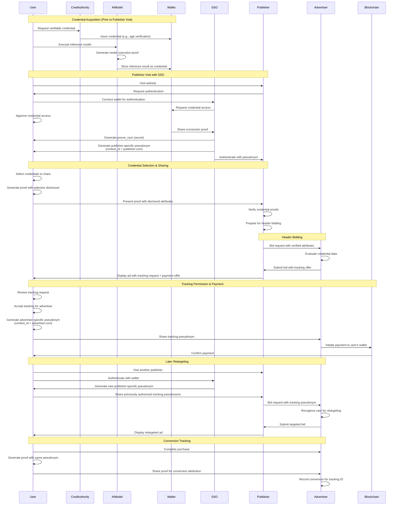

Complimentary documentation:
[[* OwnYou Project-brief]]
[[*OwnYou's Vision and User Experiences]]
[[*OwnYou Consumer App Development Specification]]
[[BBS+ Pseudonyms]] - the original BBS+ Pseudonym specification
[[* BBS+ Pseudonymous ID specification v1]] - a first take on how that might looks within the overall OwnYou framework.
[[* BBS+ Pseudonym Recommendations]] - on how the first take might be improved.
NOTE: the BBS+ Pseudonym architecture is a work in progress and needs to be completed in context of both the consumer application requirements and the Advertising requirements, which include the OwnYou SSO speficition.
## 1. Executive Summary
The Next-Generation User Consensual Advertising Tracking System aims to revolutionize digital advertising by creating a privacy-first, user-controlled tracking mechanism that respects user consent while providing valuable attribution data to advertisers. The system will enable pseudonymous tracking of ad impressions, clicks, and conversions across multiple domains and devices while ensuring users maintain control and receive compensation for sharing their data.

Key innovations include:

- Fully decentralized architecture with no central services
- User-controlled pseudonymous identifiers specific to each advertising, campaign specific, relationship
- Selective disclosure of user attributes using advanced cryptography
- Campaign-specific tracking that prevents cross-campaign correlation
- Direct compensation to users via cryptocurrency micropayments
- Integration with existing ad-tech infrastructure

This document outlines the requirements for a technical proof of concept that demonstrates how BBS pseudonyms can be utilized in digital advertising as a privacy-preserving alternative to third-party cookies. The solution enables users to selectively disclose personal information to advertisers, receive compensation for allowing tracking, and establishes a transparent value exchange between users, publishers, and advertisers.

The proof of concept will simulate a full advertising flow from single sign-on through header bidding to ad rendering and retargeting, with blockchain-based micropayments to users who opt into tracking.

Within the overall OwnYou value proposition, this MVP addresses publishers and advertisers.
There is a separate MVP that addresses consumer requirements. That MVP demonstrates how consumers can; 1) aggregate their personal data and verified credentials, 2) interact with personal private AI, 3) generate high resolution reliable consumer profiles 4) create, store and share those profiles with publishers through a decentralized single-sign-on. This Consumer MVP is not part of the Advertising MVP. 
## 2. Problem Statement

Current digital advertising tracking systems face significant challenges:

- Privacy regulations increasingly restrict cross-site tracking
- Users have limited control over their data
- Third-party cookies are being deprecated by major browsers
- Lack of transparency in how user data is used and shared
- No direct compensation to users for their valuable attention and personal data
- Advertisers face increasing difficulty in attribution and measurement
- Advertisers face large scale fraud

This system addresses these challenges by creating a user-centric, privacy-preserving approach to ad tracking authentic humans, benefiting both users and advertisers.

## 3. MVP Objectives

1. Demonstrate how BBS pseudonyms enable privacy-preserving user recognition across domains and devices
2. Show how users can control what personal information is shared with advertisers using a simple user interface that abstracts away digital wallet functionality to store and manage personal data and digital keys. 
3. Illustrate a new economic model where users are directly compensated for their attention and data; show how sharing personal data leads to relevant ads and how tracking leads to income
4. Provide a technical reference implementation that potential publishers and ad tech partners can evaluate
5. Showcase selective disclosure capabilities of BBS signatures in a real-world context
6. Maintain pseudonymous identity across interactions with the same advertiser for a specific campaign
7. Prevent tracking across different campaigns or different advertisers by any stakeholder or tech provider. i.e. prevent malicious advertisers or malicious Demand Side Platforms.

## 4. Target Audience

- **Primary:** Publishers and advertising technology partners evaluating privacy-preserving ad tech
- **Secondary:** Privacy advocates and regulators interested in cookie alternatives
- **Tertiary:** Developers implementing privacy-enhancing technologies

## 5. User Journey & Core Features

### 5.1 Credential Selection and Sharing Controls

1. User accesses a dashboard (in the OwnYou user app - Digital Wallet with Credential & Consent Manager) to select which credentials and attributes they're willing to share
2. Interface shows available verifiable credentials from recognized authorities (government IDs, certifications, third party credential providers etc.)
3. Interface shows available verifiable credentials from user-managed AI inference models. Initial bootstrap, prior to the development of the AI inference workflow, has the user enter the values manually.
4. User selects specific credentials and attributes they're willing to disclose to advertisers
5. System confirms selections and updates the user's sharing preferences
6. User can create different credential sharing "profiles" for different contexts
7. All credentials and profiles are stored in the OwnYou user app (Digital Wallet with Credential & Consent Manager).
8. The OwnYou user app includes an integrated digital wallet (Digital Wallet with Credential & Consent Manager)
9. The OwnYou user app is integrated with the custom SSO system - OwnYou SSO

### 5.2 Single Sign-On with Pseudonymous ID

1. User navigates to a publisher website
2. User is prompted to log in via the custom SSO system - OwnYou SSO
3. User authenticates by connecting their digital wallet (OwnYou user App) containing existing verifiable credentials
4. As part of the log-in process, user default sharing profile is automatically selected but the user has the option to select another profile
5. System generates a one-time pseudonymous ID for this session
6. User is logged into the publisher site without revealing their true identity

### 5.3 Bid Stream Information Sharing

1. When user visits a page with ad slots, the publisher initiates header bidding
2. System prepares a bid request including selectively disclosed user information as first-party data
3. Bid request is cryptographically signed to ensure authenticity (preferably with a proof-of-human signature)
4. Advertisers receive bid request with anonymous but verified user attributes, a one-time pseudonymous ID, BBS Pseudonyms for all existing tracking agreements
5. System simulates the bidding process with multiple advertisers, including how advertiser use BBS Pseudonyms to track the user through the marketing funnel, to retarget the user with an ongoing advertising campaign and to request ongoing tracking. 

### 5.4 Ad Rendering with Tracking Request

1. Winning advertiser's ad is rendered on the page
2. Ad includes a component requesting permission to track the user
3. Component displays a transparent offer of payment in exchange for tracking
4. Payment amount is verified against the blockchain
5. User is presented with clear terms of what tracking entails

### 5.5 Tracking Permission and Compensation

1. User reviews tracking request and payment offer
2. If accepted, system generates a pseudonymous tracking ID using BBS pseudonyms
3. Blockchain transaction is initiated to transfer payment to user's wallet
4. Tracking ID is cryptographically bound to the specific advertiser context
5. Confirmation of the exchange is displayed to the user

### 5.6 Retargeting and Conversion Tracking

1. When user visits another publisher site and logs in via the SSO
2. System recognizes user and includes the tracking ID in bid requests to authorized advertisers
3. Authorized advertisers can recognize the user and bid accordingly
4. System demonstrates how conversion events (purchases, sign-ups) can be tracked
5. Reporting shows the effectiveness of the tracking while maintaining user privacy

## 5. Technical Requirements

### 5.1 BBS Pseudonyms Implementation

- Implement or integrate a working implementation of BBS signatures
- Implement the pseudonym extension as described in the specification
- Ensure the implementation handles:
    - Signature generation and verification
    - Selective disclosure proofs
    - Context-bound pseudonym generation
    - Zero-knowledge proofs for pseudonym validation
- Provide a mechanism to verify that pseudonyms from the same user cannot be linked across contexts

### 5.2 Single Sign-On System

- Build on existing standards (OAuth 2.0/OpenID Connect) where possible
- Support integration with digital wallets containing verifiable credentials
- Connect with recognized credential authorities and AI inference credential systems
- Generate and manage pseudonymous identifiers
- Provide a clean, usable login flow that maintains user privacy

### 5.3 Credential Management and Selective Disclosure Interface

- Create an intuitive UI for users to select credentials and attributes they wish to share
- Support multiple credential sources (government authorities, institutions, user-managed AI models)
- Implement credential presentation with selective disclosure using BBS signatures
- Ensure cryptographic verification of disclosed attributes
- Support different disclosure profiles for different contexts
- Visualize to users what credential information is being shared

### 5.4 Header Bidding Simulation

- Create a realistic simulation of programmatic header bidding
- Implement bid request generation with selectively disclosed user data
- Design a system to include pseudonymous IDs in bid requests where authorized
- Simulate multiple bidders with different targeting requirements
- Visualize the bidding process for demonstration purposes

### 5.5 Blockchain Integration

- Research and select an appropriate blockchain with:
    - Fast transaction confirmation
    - Low transaction fees
    - High scalability
    - Smart contract support
- Implement a simple payment protocol for advertiser-to-user compensation
- Create a mechanism to verify payment receipt
- Handle wallet connection and transaction signing
- Ensure secure management of cryptographic keys

### 5.6 Ad Rendering and Tracking

- Develop an ad rendering system that can display tracking requests
- Create infrastructure for generating and validating tracking pseudonyms
- Implement secure storage of tracking permissions
- Design a system to include tracking IDs in future bid requests
- Build conversion attribution that preserves privacy

## 6. Technical Architecture

**6.1. Core Cryptographic Functionality:**
	1.0.1. **Integrate the @mattrglobal/bbs-signatures library directly** into your Node.js backend service (the "BBS Pseudonym Service" or integrated into the "SSO Provider").
    1.0.2. Implement the **pseudonym generation and verification logic** as per the specification ([[BBS+ Pseudonyms]]), using this library. This gives you precise control over the critical cryptographic element. ==*Remember to upload the BBS Pseudonym Specs*==
    1.1. **BBS Signature Implementation:** Must provide capabilities to create and verify BBS signatures over sets of attributes.
    1.2. **BBS Pseudonym Extension:** Must implement the context-specific pseudonym generation (`hash_to_curve_g1(context_id) * nym_secret`) and verification linked to a BBS signature.
    1.3. **Selective Disclosure:** Must support generating zero-knowledge proofs for selectively disclosing attributes from a BBS-signed credential.
    1.4. **Proof Verification:** Must support verifying the selective disclosure proofs.
    1.5. **Controllability:** All cryptographic operations (key generation simulation, signing, pseudonym generation, proof generation) must be controllable via backend logic, simulating the actions of the user's "OwnYou" app/wallet based on user intent captured in the frontend.

**6.2. User-Publisher Authentication & Data Sharing (Process 2):**
    2.1. **SSO Protocol:** Must implement an OIDC-like Single Sign-On flow where the PoC backend acts as the Identity Provider (IdP) and the simulated Publisher site acts as the Relying Party (RP). Compatibility with standard OIDC is highly desirable for future publisher integration.
    2.2. **Custom Data Transport:** The OIDC flow must be customizable to securely transport:
        *   A temporary session identifier for the Publisher.
        *   The BBS selective disclosure proof containing user-consented attributes.
        *   Relevant, existing advertiser-specific BBS tracking pseudonyms for authorized advertisers.
    2.3. **Contextual Pseudonymity:** The flow must ensure the Publisher only receives pseudonymous identifiers (session ID, tracking pseudonyms) and verified attributes, not the user's underlying app identity or keys.

**6.3. "OwnYou" App Simulation (Process 1 Agency):**
    3.1. **State Management Simulation:** The backend must simulate the storage and retrieval of:
        *   User's sharing preferences/profiles.
        *   Simulated Verifiable Credentials (containing attributes).
        *   User's master secret for pseudonym generation (`nym_secret`).
        *   Previously generated advertiser-specific tracking pseudonyms and associated consent status.
        *   Simulated crypto wallet address for payments.
    3.2. **Orchestration:** The backend must orchestrate calls to the cryptographic library (Requirement 1) based on simulated user actions from the frontend (e.g., "login", "approve tracking").
    3.3. **User Authentication Simulation:** A basic mechanism to simulate the user being "logged into" their OwnYou app environment is needed for the PoC backend to act on their behalf.

**6.4. AdTech Flow Simulation:**
    4.1. **Header Bidding Simulation:** Backend/Frontend logic to mimic the request/response flow of header bidding, injecting the BBS proofs/pseudonyms into simulated bid requests.
    4.2. **Ad Rendering & Consent:** Frontend component to display a simulated ad containing a tracking request and payment offer.
    4.3. **Tracking Consent Handling:** Logic to capture user consent/rejection for tracking, trigger pseudonym generation (via Requirement 1.2 & 3.2), and initiate simulated payment (Requirement 5).
    4.4. **Retargeting Simulation:** Logic to demonstrate how an existing tracking pseudonym is included in subsequent bid requests to the authorized advertiser.
    4.5. **Conversion Tracking Simulation:** A mechanism to simulate a conversion event being attributed back to a tracking pseudonym.

**6.5. Blockchain Integration:**
    5.1. **Payment Simulation:** Mechanism to simulate initiating a blockchain transaction from the advertiser to the user's simulated wallet address upon tracking consent. Direct blockchain interaction is required.
    5.2. **Network Choice:** Must support a low-fee, high-throughput blockchain suitable for micropayments (e.g., Polygon, Solana, other L2s).
    5.3. **Wallet Interaction Simulation:** Backend logic to handle the simulated user wallet address and interact with the chosen blockchain network library.

**6.6. Technical Stack & Architecture:**
    6.1. **Frontend:** A modern JavaScript framework for building the interactive UI.
    6.2. **Backend:** A robust framework capable of handling APIs, orchestration, and integrations.
    6.3. **Modularity:** Components (Crypto, SSO, AdTech Sim, Blockchain) should be logically separated for clarity and potential future replacement.
    6.4. **Containerization:** The PoC should be easily deployable using Docker/Docker Compose.
    6.5. **Language Consistency:** Preferably maintain language consistency (e.g., TypeScript/JavaScript) across frontend and backend where practical to simplify development.

**6.7. Non-Functional Requirements:**
    7.1. **Minimize Complexity:** Prioritize libraries/tools with clear APIs and good documentation that directly address the requirements without excessive configuration or boilerplate for the MVP.
    7.2. **Extensibility/Swappability:** Choose tools based on standards and with clear interfaces, making it easier to enhance or replace components post-MVP. Avoid overly opinionated frameworks that lock in specific patterns unrelated to the core problem.
    7.3. **Ease of Integration:** Select libraries designed to work well together within the chosen ecosystem (e.g., Node.js).

## 7. Recommendations for Tools/Libraries/Solutions

Based on the requirements and priorities (simplicity, extensibility, integration):

**7.1. Core Cryptographic Functionality (BBS):**
    *   **Recommendation:** `@mattrglobal/bbs-signatures` (JavaScript/TypeScript library)
    *   **Reasoning:**
        *   **Direct Fit:** Directly implements BBS signatures and is the library mentioned in your spec. Provides the necessary primitives for signing, verifying, deriving proofs, etc.
        *   **Simplicity:** As a JS library, it integrates directly into a Node.js backend with minimal friction.
        *   **Extensibility:** You will need to build the specific pseudonym logic (`hash_to_curve_g1(context_id) * nym_secret`) *using* this library's primitives, giving you full control over that specific, crucial extension.
        *   **Integration:** Native JS library integrates seamlessly.

**7.2. User-Publisher Authentication & Data Sharing (SSO):**
    *   **Recommendation:** `oidc-provider` (Node.js library)
    *   **Reasoning:**
        *   **Simplicity & Control:** A dedicated library for *being* an OIDC provider in Node.js. Highly configurable, allowing you to precisely define the interaction flow and inject your custom BBS proofs/pseudonyms into standard OIDC tokens (e.g., `id_token`) or the UserInfo endpoint response.
        *   **Standards-Based:** Adheres to OIDC standards, maximizing future compatibility with real publishers.
        *   **Extensibility:** Designed for customization. You can hook into various points in the OIDC flow to add your specific logic.
        *   **Integration:** Well-established within the Node.js ecosystem. Easier integration path for a Node.js backend compared to bringing in Java/Kotlin components (like Walt.id OIDC) just for this piece in the PoC.

**7.3. "OwnYou" App Simulation / Backend Framework:**
    *   **Recommendation:** Node.js with **Express.js** (or optionally **NestJS**) using TypeScript.
    *   **Reasoning:**
        *   **Simplicity (Express):** Express is minimal and unopinionated, allowing quick setup for APIs and routing. You define the structure. Great for speed in a PoC.
        *   **Structure & Extensibility (NestJS):** NestJS provides a more structured, opinionated framework (modules, controllers, services) that can enforce better organization from the start, potentially making the transition to production smoother. It has a slightly steeper initial learning curve than Express. *Choose Express for maximum speed/simplicity in the PoC, consider NestJS if the team prefers structure and anticipates rapid post-PoC expansion.*
        *   **Integration:** Both integrate seamlessly with `@mattrglobal/bbs-signatures` and `oidc-provider`. TypeScript provides type safety helpful for complex interactions.

**7.4. AdTech Flow Simulation:**
    *   **Recommendation:** Custom logic within the Node.js backend (Express/NestJS) and the React frontend.
    *   **Reasoning:** This simulation is highly specific to your use case. Standard libraries won't cover the full flow (injecting BBS into bids, consent UI, etc.). Build this logic using your chosen backend/frontend frameworks.

**7.5. Blockchain Integration:**
    *   **Recommendation:** `ethers.js` (JavaScript/TypeScript library)
    *   **Reasoning:**
        *   **Simplicity & Popularity:** Mature, well-documented library for interacting with Ethereum and EVM-compatible chains (Polygon, many L2s). Makes tasks like sending transactions straightforward from a Node.js backend.
        *   **Extensibility:** Supports most EVM chains, allowing flexibility in choosing the specific network later without changing the core integration library.
        *   **Integration:** Native JS library. The backend service will use `ethers.js` to send simulated payments from a funded "advertiser" wallet to the user's simulated wallet address. *Note: For the PoC, you can simulate this using a testnet (e.g., Polygon Mumbai, Sepolia) or even a local development network (Hardhat/Anvil).*

**7.6. Technical Stack & Architecture:**
    *   **Frontend:** **React** with TypeScript (as per spec), potentially with **TailwindCSS** for styling.
    *   **Backend:** **Node.js** with **Express.js** (or NestJS) using TypeScript.
    *   **Cryptography:** `@mattrglobal/bbs-signatures` (integrated into backend).
    *   **SSO:** `oidc-provider` (integrated into backend).
    *   **Blockchain:** `ethers.js` (integrated into backend).
    *   **Containerization:** **Docker** and **Docker Compose**.

**7.7. State Management (Frontend):**
    *   **Recommendation:** Choose a standard React state management library like **Zustand**, **Redux Toolkit**, or React Context API depending on complexity and team preference.
    *   **Reasoning:** Needed for managing UI state, simulated user preferences, and interaction flows on the frontend. Zustand is often praised for simplicity.

**7.8 Recommended Stack Summary:**

*   **Frontend:** React, TypeScript, TailwindCSS, Zustand (or alternative)
*   **Backend:** Node.js, TypeScript, Express.js (or NestJS)
*   **Crypto:** `@mattrglobal/bbs-signatures`
*   **SSO:** `oidc-provider`
*   **Blockchain:** `ethers.js` (targeting an EVM L2 testnet initially)
*   **Deployment:** Docker / Docker Compose

This stack prioritizes JavaScript/TypeScript consistency, leverages dedicated libraries for complex tasks (OIDC, BBS, Blockchain), and offers flexibility (minimalist Express or structured NestJS) while keeping the integration paths relatively straightforward for the MVP. It provides a solid foundation that can be extended or have components swapped out more easily later.
### 8. Data Flow

1. User authenticates → Receives session credential → Configures sharing preferences
2. Page load → Header bidding initiated → Selective disclosure applied → Bids collected
3. Winning bid → Ad rendered → Tracking request presented → User decides
4. If tracking accepted → Blockchain payment initiated → Tracking pseudonym generated
5. Future visits → Tracking pseudonym included in bid requests → Retargeting enabled

### 9. Technical Stack Recommendation

- **Frontend:** React, TypeScript, TailwindCSS
- **Backend:** Node.js with Express
- **BBS Implementation:** Use existing libraries (e.g., @mattrglobal/bbs-signatures, https://github.com/mattrglobal/pairing_crypto) with custom extensions for pseudonyms
- **Blockchain:** Consider Polygon, Solana, or Ethereum L2 solutions for low fees and high throughput
- **Containerization:** Docker for easy deployment
- **Hosting:** AWS or similar cloud provider


## 10. Appendix: Technical Concepts

### 10.1 BBS Signatures Overview

BBS signatures are a cryptographic scheme that allows for signing multiple messages at once and then selectively disclosing a subset of those messages without revealing the signature itself. This is achieved through zero-knowledge proofs that convince a verifier that the disclosed messages were part of a valid signature without revealing any additional information.

### 10.2 BBS Pseudonyms Extension

The pseudonym extension to BBS signatures allows for creating context-specific identifiers that:

- Are unique per user and context
- Cannot be linked across different contexts
- Can be cryptographically verified as belonging to a specific user
- Are bound to the BBS signature

The pseudonym is calculated using:

```
pseudonym = hash_to_curve_g1(context_id) * nym_secret
```

Where `nym_secret` is known only to the user and `context_id` is the specific context (e.g., an advertiser identifier).

### 10.3 Header Bidding Process

Header bidding is a programmatic advertising technique where publishers offer inventory to multiple ad exchanges simultaneously before making calls to their ad servers. In our implementation, we'll simulate this process using prebid.js and enhance it with selectively disclosed user information secured by BBS signatures.

### 10.4 Blockchain Micropayments

The system will leverage blockchain technology to facilitate small payments from advertisers to users in exchange for tracking permissions. These micropayments will be transparent, verifiable, and executed with minimal fees to ensure economic viability.



```

