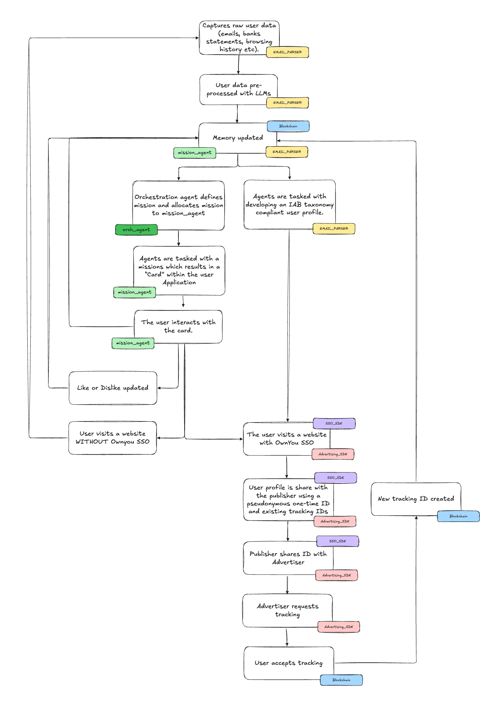

# Mission Agents Architecture - Evolution from Initial Concept

This document shows the **architectural evolution** from initial brainstorming to final design.

**Status:** Historical reference with architectural evolution mapping

---

## Initial Concept Diagram (October 2024)



This diagram represents our starting point for thinking about Mission Agents. It correctly identified the key architectural concerns but has been significantly refined through research and design.

---

## What This Diagram Got Right ✅

### 1. **Separation of Concerns**
- **Left (Green)**: Mission Agents for user utility
- **Right (Yellow/Purple/Pink)**: IAB Taxonomy for advertising
- **Center**: Shared Memory as single source of truth

✅ **This core separation remains in the final architecture**

### 2. **Feedback Loop**
- User interaction → Like/Dislike → Memory update
- Enables mission refinement over time

✅ **Final architecture expands this with structured + natural language feedback**

### 3. **Mission Cards**
- Mission agents create cards for user application
- Cards are the primary user interaction point

✅ **Final architecture includes detailed Mission Card data models**

### 4. **Memory-Driven Triggers**
- "Memory updated" triggers mission agents
- Both IAB and Mission agents read/write memory

✅ **Final architecture expands to 4 trigger types**

---

## How the Architecture Evolved 🔄

### Initial Concept → Final Architecture Mapping

| Initial Concept (Diagram) | Final Architecture | What Changed |
|---------------------------|-------------------|--------------|
| **"Orchestration agent"** (single entity) | **Adaptive Multi-level Routing** | Instead of one orchestration agent, we classify missions by complexity (1-3) and route to appropriate graph pattern |
| **"mission_agent"** (single green box) | **3 Complexity Levels** | Level 1 (Simple), Level 2 (Coordinated), Level 3 (Complex) with different LangGraph patterns |
| **"Memory updated"** (simple trigger) | **4 Trigger Types** | Memory changes, scheduled (cron), user-initiated, external events (webhooks) |
| **"Like or Dislike updated"** | **Hybrid Feedback System** | Structured buttons (✅/❌/⏸️/⭐) + optional natural language analyzed by LLM |
| **"Memory"** (single storage) | **Store + Checkpointer** | LangGraph Store (cross-thread) + PostgreSQL Checkpointer (thread-specific state) |
| **Linear workflow** | **ReAct-based Persistent Threads** | Missions are long-running processes that can pause for days/weeks |
| **Implicit state** | **Explicit Thread Lifecycle** | CREATED → PLANNING → EXECUTING → INTERRUPTED → REFLECTING → COMPLETED |
| **Single mission execution** | **Interrupt-driven Multi-round** | User can pause, provide feedback, resume with full context |

---

## Detailed Evolution by Component

### 1. Mission Agent Execution Model

**Initial Concept:**
```
Orchestration agent → allocates mission → mission_agent → creates card → done
```

**Final Architecture:**
```
Trigger detected → Classify complexity (1-3) → Route to appropriate graph:
  - Level 1: Direct execute → present → interrupt
  - Level 2: Parallel APIs → aggregate → rank → present → interrupt
  - Level 3: Deep planning → hierarchical coordination → synthesis → present → iterate
```

**Key Improvements:**
- **Adaptive routing** based on mission needs (not agent type)
- **Persistent threads** that can pause/resume
- **Multi-round refinement** for complex missions
- **File system** for Level 3 missions (store intermediate artifacts)

### 2. Memory Architecture

**Initial Concept:**
```
Single "Memory" block updated by both IAB and Mission agents
```

**Final Architecture:**
```
LangGraph Store (Long-term, cross-thread):
  - User preferences (dietary, travel, budget)
  - Ikigai profile (life purpose, interests)
  - Mission learnings (patterns across all missions)

PostgreSQL Checkpointer (Short-term, thread-specific):
  - Mission execution state
  - Interrupt points (where user paused)
  - Subgoal progress
  - Can pause for days/weeks, resume with full context
```

**Key Improvements:**
- **Separation of concerns**: Long-term patterns vs short-term execution state
- **Cross-thread learning**: Insights from one mission benefit all future missions
- **Pause/resume capability**: Threads persist across interrupts
- **Semantic search**: Query Store for relevant context

### 3. Feedback Processing

**Initial Concept:**
```
Like or Dislike updated → feeds back to Memory
```

**Final Architecture:**
```
Structured Feedback (always):
  - Completion status: ✅ Complete / ❌ Failed / ⏸️ Pause
  - Quality rating: ⭐⭐⭐⭐⭐
  - Usefulness: 💯 Extremely / 👍 Helpful / 😐 Neutral / 👎 Not Useful

Optional Natural Language:
  - User provides text: "too expensive for weeknight"
  - LLM extracts preferences: dining.weeknight_budget = "lower than $50"
  - Updates Store for future missions
  - Flags for human review if complaint detected
```

**Key Improvements:**
- **Multi-dimensional feedback**: Beyond binary like/dislike
- **Preference extraction**: LLM learns from qualitative feedback
- **Immediate application**: Next mission uses updated preferences
- **Human oversight**: Support team notified of issues

### 4. Trigger System

**Initial Concept:**
```
Memory updated → triggers agent
```

**Final Architecture:**
```
1. Memory Change Triggers:
   - Store update: user adds "Paris" to wishlist → Travel Agent triggers

2. Schedule-based Triggers:
   - Cron: Monthly bill review, quarterly wardrobe refresh
   - Event-relative: 30 days before birthday → Event Agent triggers

3. User-initiated Triggers:
   - Direct request: "Find me Italian restaurant for Friday"
   - Highest priority (urgent)

4. External Event Triggers:
   - Calendar webhook: Meeting in new city → Travel Agent
   - Email webhook: Price drop alert → Shopping Agent
   - Social webhook: Friend tags location → Travel Agent
```

**Key Improvements:**
- **Proactive missions**: System suggests based on schedule/events
- **User control**: Can explicitly request missions
- **Priority system**: User requests > external events > memory changes > scheduled
- **Conflict resolution**: Queue management when multiple triggers fire

### 5. Mission Card Output

**Initial Concept:**
```
Agent creates "Card" for user application
```

**Final Architecture:**
```python
class MissionCard(BaseModel):
    # Identity
    mission_id: str
    user_id: str
    thread_id: str  # NEW: For pause/resume

    # Classification
    card_type: str  # "savings_shopping", "ikigai_travel"
    complexity_level: Literal[1, 2, 3]  # NEW: Complexity routing

    # State Management
    state: MissionState  # PENDING/ACTIVE/SNOOZED/COMPLETED
    checkpoint_id: Optional[str]  # NEW: Resume point

    # Versioning (for refinement)
    mission_version: str  # 1.0, 2.0 after feedback
    parent_mission_id: Optional[str]  # Links to original

    # Memory Provenance
    trigger_type: TriggerType  # What caused this mission
    memory_context: dict  # Memories used by agent

    # User Interaction
    user_feedback: Optional[UserFeedback]
    qualitative_feedback: List[QualitativeFeedback]  # NEW: NL text

    # Card Data (polymorphic)
    card_data: dict  # Specific to card type
```

**Key Improvements:**
- **Thread tracking**: Can pause and resume missions
- **Versioning**: Track refinement cycles
- **Memory provenance**: Understand why mission was created
- **Qualitative feedback**: Rich user input for refinement

---

## Final Architecture Resources

**For complete implementation details, see:**

### 1. **Mission Agents Architecture**
`docs/plans/mission_agents_architecture.md`

Key sections:
- Section 2: Mission Thread Architecture (ReAct Model)
- Section 3: Adaptive Mission Architecture (3 complexity levels)
- Section 4: Graph Patterns by Complexity (LangGraph code examples)
- Section 6: Memory Architecture (Store + Checkpointer schemas)
- Section 7: Trigger System Design (implementation logic)
- Section 8: Feedback Processing (LLM analysis patterns)
- Section 9: Extensibility Framework (plugin architecture)

### 2. **End-to-End Architecture**
`docs/plans/end-to-end-architecture.md`

Key sections:
- Section 1: System Integration (how Mission Agents connect to IAB, SSO, App)
- Section 2: Mission Card Data Model (Pydantic schemas)
- Section 3: Mission Agent Architecture Summary

---

## Simplified Final Architecture Diagram

```
┌─────────────────────────────────────────────────────────────────┐
│                    TRIGGER SYSTEM (4 Types)                      │
│  1. Memory Changes  2. Scheduled  3. User Requests  4. External │
└────────────────────────────┬────────────────────────────────────┘
                             ↓
┌─────────────────────────────────────────────────────────────────┐
│              MISSION ORCHESTRATION (Complexity Router)           │
│                                                                  │
│  Classify mission complexity → Route to appropriate graph:      │
│    - Level 1: Simple (Direct execution)                         │
│    - Level 2: Coordinated (Parallel APIs)                       │
│    - Level 3: Complex (Hierarchical planning)                   │
└────────────────────────────┬────────────────────────────────────┘
                             ↓
┌──────────────────┬──────────────────┬──────────────────────────┐
│  LEVEL 1 GRAPH   │  LEVEL 2 GRAPH   │  LEVEL 3 GRAPH          │
│  (Shopping)      │  (Restaurant)    │  (Travel)               │
│                  │                  │                          │
│  Execute →       │  Plan →          │  Deep Planning →        │
│  Present →       │  [Parallel APIs] │  [Hierarchical Coords]  │
│  Interrupt       │  Aggregate →     │  Synthesis →            │
│                  │  Rank →          │  Present Draft →        │
│                  │  Present →       │  Iterate (multi-round)  │
│                  │  Interrupt       │                          │
└────────┬─────────┴────────┬─────────┴────────┬────────────────┘
         │                  │                  │
         └──────────────────┴──────────────────┘
                             ↓
┌─────────────────────────────────────────────────────────────────┐
│                     MISSION CARD CREATED                         │
│  - Presented to user in dashboard                               │
│  - User provides feedback (structured + optional NL)            │
│  - Thread can pause/resume via interrupt()                      │
└────────────────────────────┬────────────────────────────────────┘
                             ↓
┌─────────────────────────────────────────────────────────────────┐
│                    FEEDBACK PROCESSING                           │
│  - Structured: ✅/❌/⏸️ + ⭐ rating + usefulness                 │
│  - Optional NL: LLM extracts preferences → Updates Store        │
│  - Learnings applied to future missions                         │
└─────────────────────────────────────────────────────────────────┘
                             ↓
┌─────────────────────────────────────────────────────────────────┐
│                         MEMORY LAYER                             │
│                                                                  │
│  LangGraph Store (Long-term):        PostgreSQL Checkpointer:  │
│  - User preferences                  - Thread execution state   │
│  - Ikigai profile                    - Interrupt points         │
│  - Mission learnings                 - Can pause for weeks      │
└─────────────────────────────────────────────────────────────────┘
```

---

## Key Architectural Insights Gained

### 1. **Complexity-Based Routing > Agent Type-Based**
**Why:** A shopping mission can be simple ("find iPhone price") or complex ("find complete gaming setup with compatibility checks"). Routing by complexity allows the same mission type to use different patterns as needed.

### 2. **Persistent Threads > One-Shot Execution**
**Why:** Real-world missions (booking travel, planning events) take time and require user input at multiple points. Persistent threads with interrupt() enable natural human pacing.

### 3. **Store + Checkpointer > Single Memory**
**Why:** Separating long-term patterns (Store) from short-term execution state (Checkpointer) prevents mixing concerns and enables cross-thread learning.

### 4. **Structured + NL Feedback > Binary Like/Dislike**
**Why:** Users want quick feedback options (structured) but sometimes need to explain nuances (NL). LLM analysis extracts actionable preferences from qualitative text.

### 5. **Multiple Triggers > Memory-Only**
**Why:** Proactive missions (scheduled bill review) and reactive missions (user requests) serve different user needs. 4 trigger types cover all scenarios.

### 6. **Ikigai Integration > Generic Preferences**
**Why:** Understanding user life purpose (Ikigai) enables mission agents to suggest opportunities aligned with what brings them joy, not just past behavior patterns.

---

## Document History

| Version | Date | Description |
|---------|------|-------------|
| 0.1 | 2024-10-28 | Initial concept diagram created |
| 1.0 | 2025-01-04 | Evolution mapping added, final architecture linked |

---

**See final architecture specifications:**
- `docs/plans/mission_agents_architecture.md` (Mission Agents Architecture)
- `docs/plans/end-to-end-architecture.md` (End-to-End Architecture)
